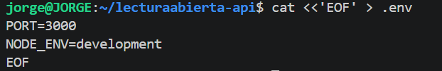
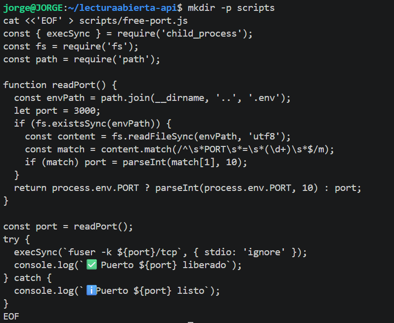
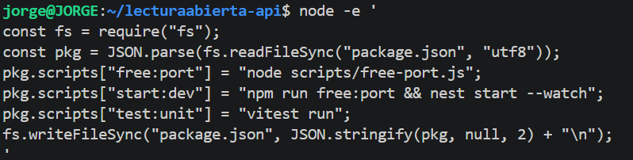
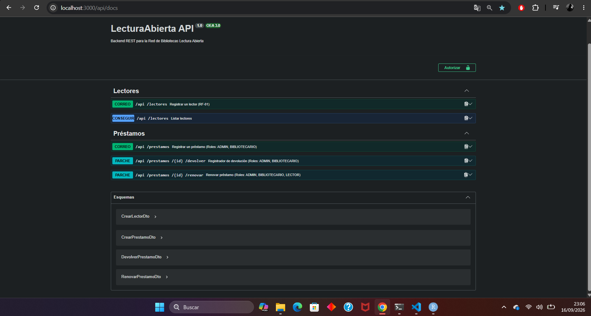

FASE 1 — 00_BASE_INIT_NESTJS

Inicialización del proyecto NestJS

Objetivo de la fase: Dejar el esqueleto oficial Nest corriendo en un puerto libre, con Git inicial.

1.1 — Crear carpetas padre y permisos

1.2 — Instalar Nest CLI (si no existe)

1.3 — Crear proyecto NestJS

1.4 — Crear .env

1.5 — Commit inicial del esqueleto

FASE 2 — 01_BASE_DEPS_Y_PUERTO

Dependencias + manejo de puerto (EADDRINUSE)

Objetivo de la fase: Instalar el stack profesional y evitar que un start:dev colgado bloquee el puerto.

2.1 — Dependencias de producción

2.2 — Dependencias de desarrollo

2.3 — Script para liberar puerto

2.4 — Actualizar scripts npm en package.json

2.5 — Verificar arranque base

FASE 3 — 02_BASE_ESTRUCTURA_CA

Estructura de carpetas Clean Architecture

Objetivo de la fase: Crear el mapa mental: config / common / infrastructure / features (business + auth).

3.1 — Crear árbol base de carpetas

FASE 4 — 03_BASE_ENTORNO_ENV

Configuración del entorno tipado (multi-base)

Objetivo de la fase: Centralizar variables en .env: selector DB_DIALECT y un bloque de credenciales por motor (MySQL, PostgreSQL, SQL Server, Oracle). Validar antes del boot.

4.1 — Crear .env.example y actualizar .env completo

4.2 — Interface de entorno

4.3 — Validación de entorno con class-validator

4.4 — Resolver de credenciales por motor

4.5 — Factory registerAs de entorno

FASE 5 — 04_BASE_DATABASE_SEQUELIZE

Base de datos multi-dialecto (Sequelize)

Objetivo de la fase: Conectar Sequelize al motor de DB_DIALECT usando el bloque DB_MYSQL_* / DB_POSTGRES_* / DB_MSSQL_* / DB_ORACLE_*. Aún sin features (ALL_MODELS vacío).

5.1 — Constante SEQUELIZE_TOKEN

5.2 — Tipos auxiliares de database config

5.3 — database.config.ts

5.4 — database.module.ts / providers

5.5 — database.providers.ts

5.6 — Opciones Sequelize por dialecto

5.7 — Factory Sequelize (sin modelos aún)

5.8 — DatabaseSeederService

5.9 — Módulo global Sequelize

5.10 — Verificar conexión a BD

CREACION DEL PROYECTO PASO A PASO LECTURA_ARBIERA
FASE 1 — 00_BASE_INIT_NESTJS
Inicialización del proyecto NestJS
1.1 — Preparar directorio de trabajo

1.2 — Generar esqueleto oficial con Nest CLI

1.3 — Crear .env inicial

FASE 2 — 01_BASE_DEPS_Y_PUERTO
Dependencias y control de puertos
2.1 — Instalar dependencias de producción
Instalación de Sequelize, drivers de bases de datos, validación, utilidades de seguridad y Swagger:

2.2 — Instalar dependencias de desarrollo

2.3 — Script de liberación de puerto (free-port.js)

2.4 — Configurar scripts npm en package.json

FASE 3 — 02_BASE_ESTRUCTURA_CA
Estructura de carpetas Clean Architecture

3.1 — Crear directorios por capas y módulos funcionales

3.2 — Declarar módulos raíz iniciales

FASE 4 — 03_BASE_ENTORNO_ENV
Configuración del entorno tipado

4.1 — Crear .env.example y plantilla local

4.2 — Interfaces de configuración tipadas

4.3 — Validador de entorno

4.4 — Fábrica de configuración

FASE 5 — 04_BASE_DATABASE_SEQUELIZE
Conexión a Base de Datos y Factory Sequelize

5.1 — Constante de inyección DI

5.2 — Opciones multi-dialecto de Sequelize

5.3 — Fábrica de instancia Sequelize con lista modular de modelos

5.4 — Servicio ejecutor de Seeders

5.5 — Módulo global de Sequelize

FASE 6 — 05_BASE_APP_COMMON_SECURITY
Piezas Transversales, Seguridad y Bootstrap

6.1 — Enums y Reglas de Estado del Dominio

6.2 — Filtros de Excepciones Globales

6.3 — Interceptor de Respuestas Unificado

6.4 — Servicios de Criptografía y Tokens JWT

6.5 — Configuración de Swagger

6.6 — Ensamblado de main.ts y app.module.ts base

FASE 7 — 06_BUSINESS_LECTORES
Entidad Lectores (RF-01)

7.1 — Entidad de Dominio Puro

7.2 — Modelo Sequelize

7.3 — Repositorio y Contrato

7.4 — DTOs, Caso de Uso y Controlador

7.5 — Módulo Lectores y Registro en ALL_MODELS

FASE 8 — 07_BUSINESS_CATALOGO_BASE
Categorías, Autores y Sedes (RF-03, RF-04, RF-05)

8.1 — Modelos Sequelize

8.2 — Actualizar fábrica Sequelize

FASE 9 — 08_BUSINESS_LIBROS_EJEMPLARES
Libros, Relación LibroAutor y Ejemplares (RF-02, RF-06, RN-02, RN-03)

9.1 — Modelos de Libros, LibroAutor y Ejemplares

9.2 — Actualizar factory Sequelize con catálogo completo

FASE 10 — 09_BUSINESS_PRESTAMOS_MULTAS
Préstamos, Reservas, Multas y Reglas de Negocio (RN-01 a RN-08)

10.1 — Modelos de Préstamo, Reserva y Multa

10.2 — DTOs para Préstamos y Devolución

10.3 — Casos de uso y Reglas de Negocio en Préstamos
Implementa transacciones ACID con Sequelize (sequelize.transaction), verificando:

RN-01: Disponibilidad del ejemplar.

RN-05: Bloqueo de renovación si hay reservas activas.

RN-06: Reincorporación a DISPONIBLE al devolver.

RN-08: Cálculo automático de multas por mora, daño o pérdida.

10.4 — Controlador de Préstamos

10.5 — Registrar todos los modelos de negocio en Sequelize Factory

FASE 11 — 10_AUTH_RBAC_GUARDS
Autenticación y Control de Acceso Basado en Roles (RBAC)

11.1 — Decorador @Roles y Guardián RBAC

11.2 — Proteger el Controlador de Préstamos con @Roles

FASE 12 — 11_INTEGRACION_Y_CHECKLIST
Seed de Datos, Pruebas Unitarias y Verificación

12.1 — Seeder Integral para Poblado de Base de Datos

12.2 — Suite de Pruebas Automatizadas (Vitest)
Verifica que las reglas de negocio críticas RN-01 y RN-05 arrojen error en las condiciones estipuladas:

12.3 — Verificación

LecturaAbierta API corriendo en
