# Manual — LecturaAbierta-express

Guía **única y autosuficiente** por **Issues (ISS-X)** verificables.
Express 5 + TypeScript + Sequelize, arquitectura por **features**.

> **Alcance de este laboratorio:** backend **business completo**
> (Client, ProductType, Product, Sale, ProductSale) **sin autenticación ni autorización**.
> Todas las rutas quedan **SIN AUTH**. Este archivo contiene **todos** los pasos
> (`cat >>` / **PARCHE**); no hace falta ningún otro `.md` para construir el backend.
>
> Cada **ISS** es un incremento comprobable. Los **sub-ítems** (`X.1`, `X.2`, …) son pasos técnicos.
> Versiones = `package.json` del repo.

### Convención de escritura en este manual

| Caso | Cómo se indica |
|------|----------------|
| **Archivo nuevo** | Siempre con `: > ruta` + `cat >> ruta << 'EOF'` … `EOF` (no basta con “crear el archivo”) |
| **Archivo ya existe** | Señalado como **PARCHE**. Indica **qué añadir/cambiar** y el ancla: **debajo de …** / **encima de …** / **dentro de …** / **reemplazar …** |
| **npm / carpetas** | Comandos `npm install`, `mkdir -p`, etc. |
| **Cierre de ISS** | Desde **ISS-01**, el último paso del ISS es `npm run dev` (el servidor debe arrancar). ISS-00 aún no tiene app. |


## Cómo usar este manual

| Concepto | Significado |
|----------|-------------|
| **ISS-X** | Unidad de trabajo con entrega demostrable |
| **Sub-ítem X.Y** | Paso dentro del ISS (npm, carpetas, archivo, parche…) |
| **DoR** | Listo para empezar el ISS |
| **DoD** | Listo para cerrar el ISS (todos los sub-ítems + verificación global) |
| **Bloqueado por** | ISS previos que deben estar Done |

### Definition of Ready (DoR)

- [ ] Leíste el objetivo y los **criterios de aceptación del ISS** (incluye todos los sub-ítems)
- [ ] Los ISS bloqueadores están cerrados
- [ ] Tienes herramientas / `.env` que el ISS pide
- [ ] Sabes cómo verificar el resultado final del ISS

### Definition of Done (DoD)

- [ ] **Todos** los criterios de aceptación del ISS (lista consolidada) cumplidos
- [ ] Código/carpetas en las rutas indicadas
- [ ] `npx tsc --noEmit` OK si hubo TypeScript
- [ ] Verificación global del ISS ejecutada
- [ ] Desde **ISS-01**: `npm run dev` arranca el servidor sin error (cierre del ISS)
- [ ] Evidencia alineada con lo construido

### Mapa

```text
1. ISS-00     Requisitos previos
2. ISS-01     Esqueleto del proyecto           (2.1 … 2.5)
3. ISS-02     Infraestructura de BD            (3.1 … 3.3)
4. ISS-03-A   Feature Client — fundación
5. ISS-03-B   Feature Client — GetAll / GetOne
6. ISS-03-C   Feature Client — Crear
7. ISS-03-D   Feature Client — Update PUT/PATCH
8. ISS-03-E   Feature Client — Delete físico / lógico
9. ISS-04     Seeders Faker (feature + runner) (9.1 … 9.2)
10. ISS-05    Swagger OpenAPI (feature + registry) → `/api/docs`
11. ISS-06    Feature ProductType              (11.1 … 11.6)
12. ISS-07    Feature Product + relación       (12.1 … 12.6 / 12.5 R)
13. ISS-08    Feature Sale + feature ProductSale + R (13.1 … 13.7)
14.           Estructura final del repo + verificación global
15.           Referencia de paquetes
```

```text
ISS-00 → … → ISS-05 → ISS-06 → ISS-07 (+R) → ISS-08 (+R) → DONE (business SIN AUTH)
```

| ISS | Entrega verificable (cierre) |
|-----|------------------------------|
| **00** | Node/npm/BD disponibles |
| **01** | App TypeScript arrancable |
| **02** | Sequelize + `.env` + carpeta `seeders/` |
| **03-A…E** | Client CRUD + http (**SIN AUTH**) |
| **04** | Seeder Client + SeedersRunner |
| **05** | Swagger UI `/api/docs` |
| **06** | ProductType CRUD + seeder + swagger `/api/tipos-producto` |
| **07** | Product CRUD + **relación** ProductType↔Product `/api/productos` |
| **08** | Sale + **feature ProductSale** + relaciones; `/api/ventas` + `/api/detalle-ventas` |

### Entidades / tablas cubiertas por ISS (business)

| Tabla BD | Clase | Feature | ISS | API |
|----------|-------|---------|-----|-----|
| `clients` | Client | `client/` | ISS-03-A…E (+04 seeder, +05 swagger) | `/api/clientes` |
| `product_types` | ProductType | `product-type/` | ISS-06 | `/api/tipos-producto` |
| `products` | Product | `product/` | ISS-07 (+R) | `/api/productos` |
| `sales` | Sale | `sale/` | ISS-08 | `/api/ventas` |
| `product_sales` | ProductSale | `product-sale/` | ISS-08 | `/api/detalle-ventas` |

Todas las tablas: `id` + `status` (`active`\|`inactive`) + `timestamps`. FKs y columnas en **snake_case**.

# 1. ISS-00 — Requisitos previos

**Objetivo:** entorno listo para el laboratorio.  
**Bloqueado por:** ninguno.

### Criterios de aceptación (ISS-00)

- [ ] `node -v` muestra v20+ (lab: v24.x)
- [ ] `npm -v` responde
- [ ] Motor de BD accesible (MySQL recomendado para el primer `sync`)

### Pasos

node -v
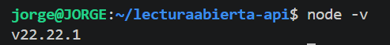
npm -v
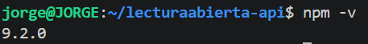

### Verificación del ISS

node -v && npm -v
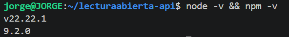

# 2. ISS-01 — Esqueleto del proyecto

**Objetivo:** proyecto npm + TypeScript + Express con estructura `features/` y servidor HTTP base.  
**Bloqueado por:** ISS-00.

### Criterios de aceptación (ISS-01) — consolidados

- [ ] **2.1** Existe `package.json` con `"type": "commonjs"` y scripts `build` / `dev`
- [ ] **2.2** Árbol `src/` con `config`, `database/seeders`, `routes`, `features/business/client` (auth **fuera de alcance** de este lab)
- [ ] **2.3** Dependencias Express/TS instaladas (`npm ls --depth=0`)
- [ ] **2.4** Existe `tsconfig.json` (`rootDir: ./src`, `outDir: ./dist`, `strict: true`)
- [ ] **2.5** Existen `src/server.ts` y `src/config/index.ts` (esqueleto App)
- [ ] `npx tsc --noEmit` sin errores al cerrar el ISS


## 2.1 Inicializar npm y scripts

**Criterios de este sub-ítem**

- [ ] `package.json` creado
- [ ] Scripts `build` y `dev` definidos

mkdir Lecturaabierta-express
cd lecturaabierta-express
npm init -y
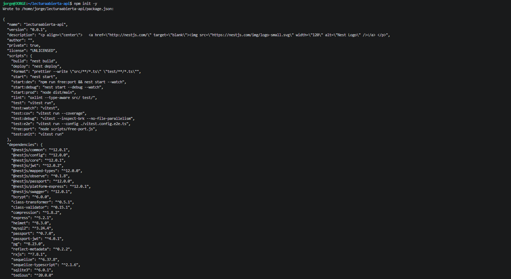
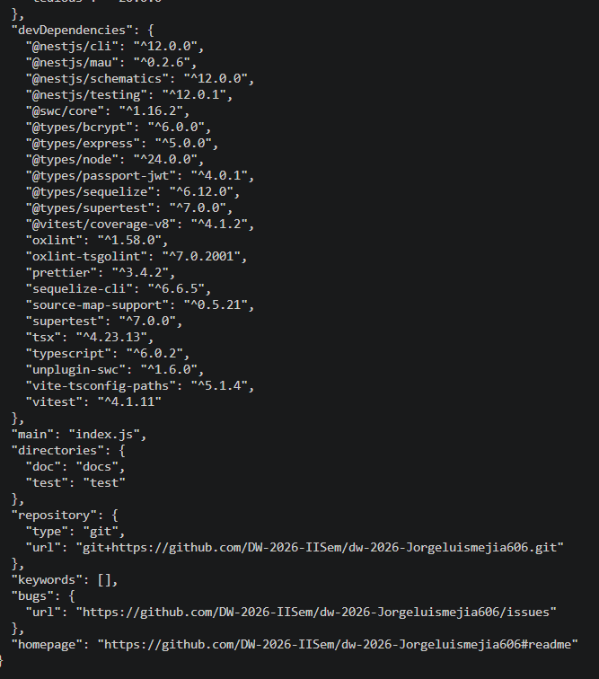
mkdir -p docs

**PARCHE** — `package.json` **ya existe** (lo creó `npm init -y`).

- **Dentro de** `"scripts"`: deja solo (o añade) `build` y `dev` como abajo.
- **Debajo de** `"license"` (o al mismo nivel que `"scripts"`): asegúrate de `"type": "commonjs"`.

Estado esperado de esas claves:

```json
{
  "scripts": {
    "build": "tsc",
    "dev": "nodemon --watch src --ext ts --exec ts-node -- src/server.ts"
  },
  "type": "commonjs"
}
```

```bash
node -e "const p=require('./package.json'); console.log(p.scripts)"
```

---
## 2.2 Estructura de carpetas (features)

**Criterios de este sub-ítem**

- [ ] Carpetas de infra y features creadas según el árbol

```bash
mkdir -p \
  src/config \
  src/database/seeders \
  src/routes \
  src/features/business/client
```

```text
src/
├── config/
├── database/
│   └── seeders/          # solo carpeta (ISS-02 §3.3); runner en ISS-04
├── routes/
├── features/
│   └── business/
│       └── client/       # más features en ISS-06…08
└── server.ts             # §2.5
```

| Carpeta | Uso |
|---------|-----|
| `features/business/<entidad>/` | model + controller + routes (+ seeder, swagger, http, associations) |
| `database/seeders/` | counts + SeedersRunner (`npm run db:seed`) |
| `routes/index.ts` | Agregador de features |
| `config/` · `database/` | Arranque e infraestructura |

**Seeders (patrón del lab)**

| Pieza | Dónde |
|-------|-------|
| Por entidad | `src/features/business/<entidad>/<entidad>.seeder.ts` |
| Runner + counts | `src/database/seeders/{index,counts}.ts` → `npm run db:seed` |
| Datos falsos | `@faker-js/faker` |


find src -type d | sort
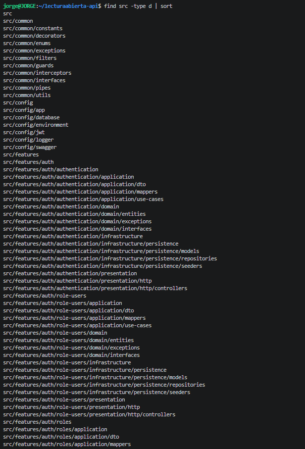
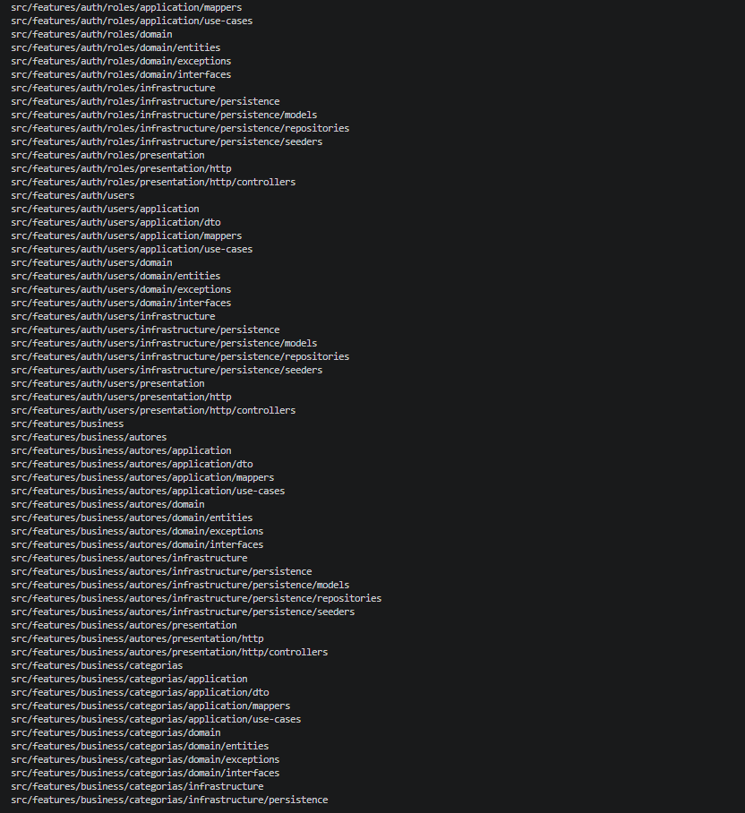
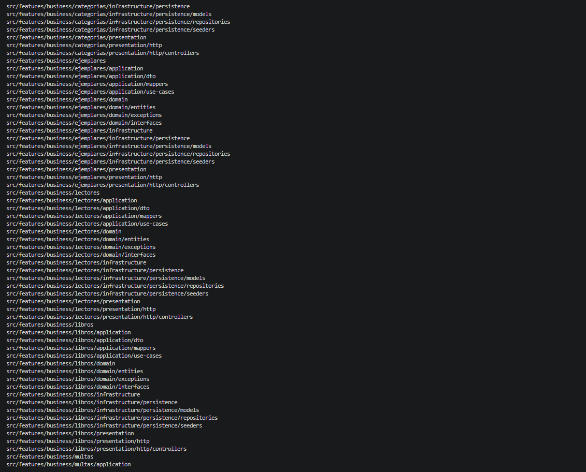
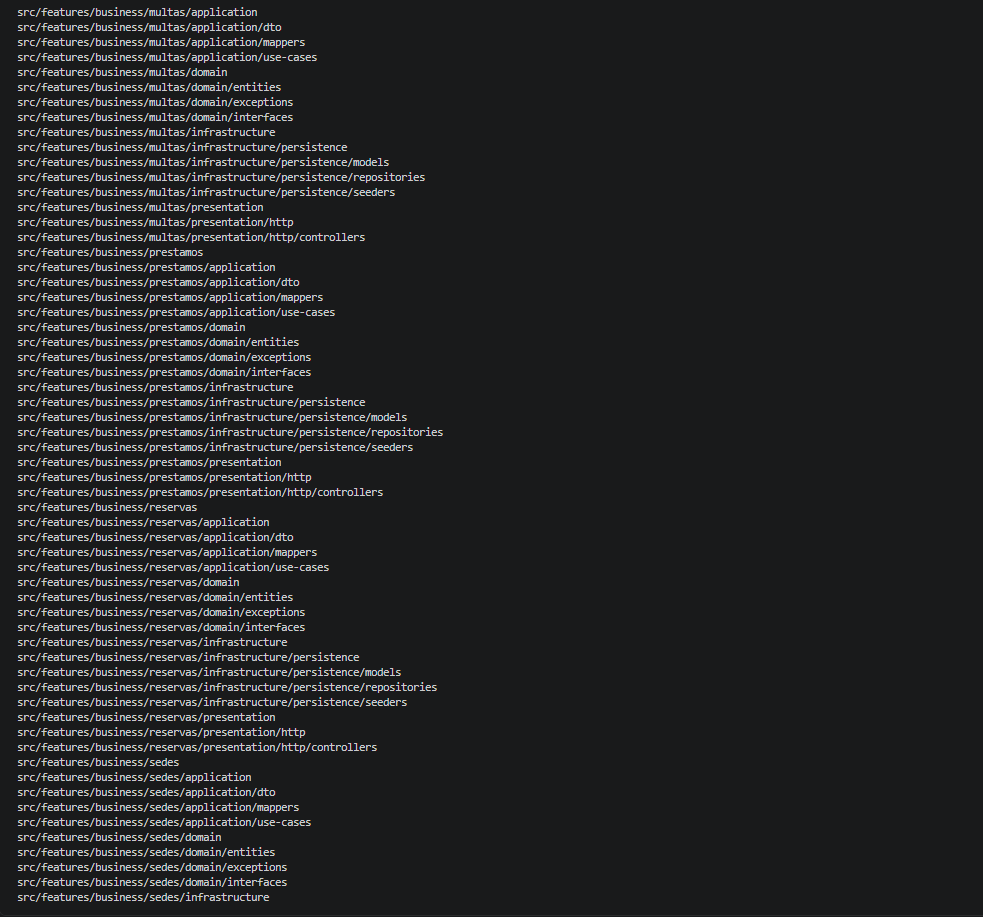
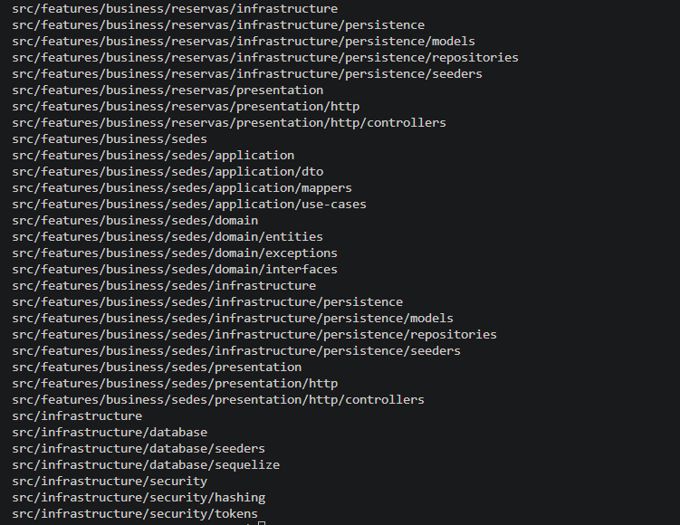

## 2.3 Dependencias base (Express + TypeScript)

**Criterios de este sub-ítem**

- [ ] `express`, `cors`, `dotenv`, `morgan` instalados
- [ ] `typescript`, `ts-node`, `nodemon`, `@types/*` instalados
``
npm install express@^5.2.1 cors@^2.8.6 dotenv@^17.4.2 morgan@^1.12.1
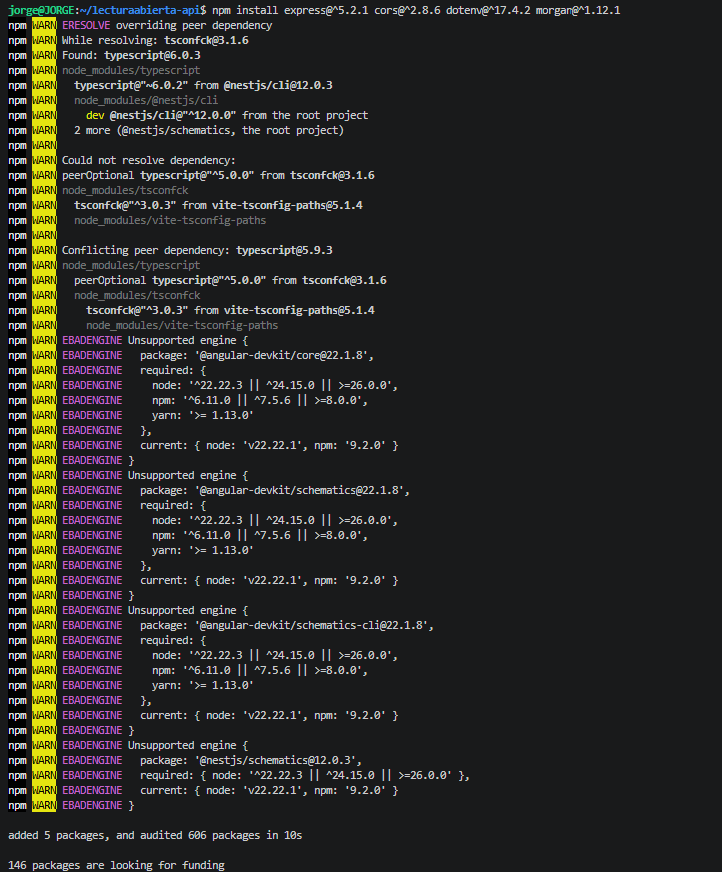

npm install -D typescript@~6.0.2 ts-node@^10.9.2 nodemon@^3.1.14 \
@types/node@^22.20.3 @types/express@^5.0.6 \
@types/cors@^2.8.19 @types/morgan@^1.9.10
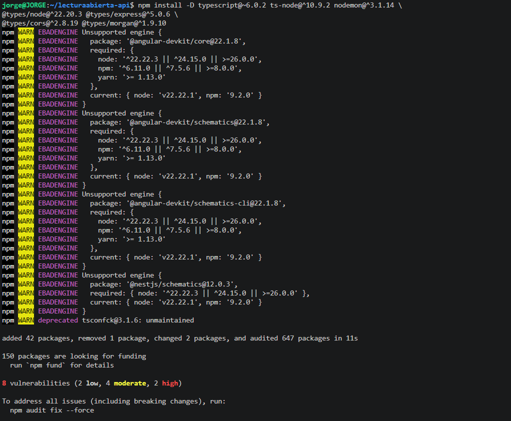

> TypeScript en **5.9.x** por compatibilidad con `ts-node`.

``
npm ls --depth=0

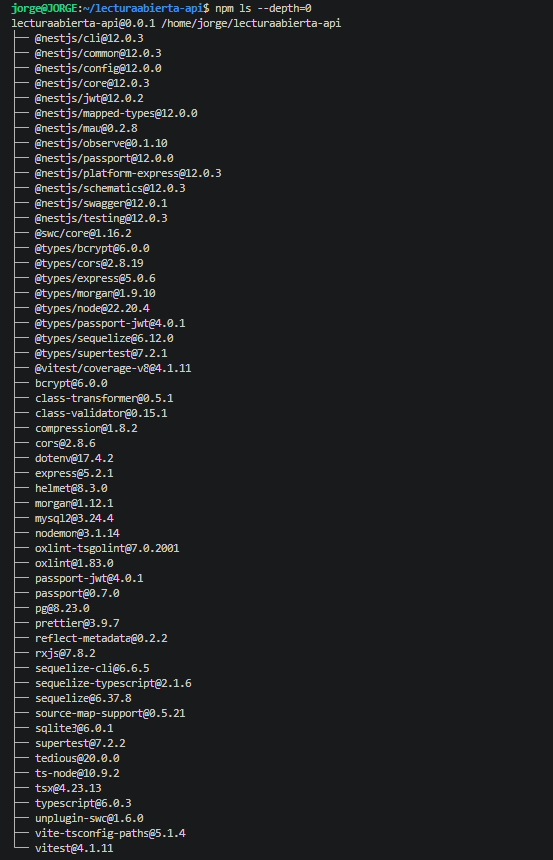

## 2.4 TypeScript (`tsconfig.json`)

**Criterios de este sub-ítem**

- [ ] `tsconfig.json` con `rootDir: ./src`, `outDir: ./dist`, `strict: true`


: > tsconfig.json
cat >> tsconfig.json << 'EOF'
{
  "compilerOptions": {
    "rootDir": "./src",
    "outDir": "./dist",
    "module": "commonjs",
    "target": "ES2020",
    "lib": ["ES2020"],
    "types": ["node"],
    "esModuleInterop": true,
    "resolveJsonModule": true,
    "sourceMap": true,
    "strict": true,
    "skipLibCheck": true,
    "moduleDetection": "force",
    "isolatedModules": true,
    "forceConsistentCasingInFileNames": true
  },
  "include": ["src/**/*"],
  "exclude": ["node_modules", "dist"]
}
EOF
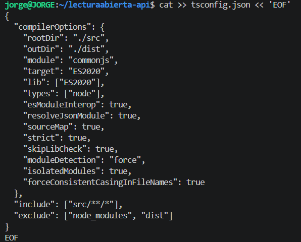

```bash
test -f tsconfig.json && npx tsc --showConfig | head -20
## 2.5 Servidor y App (esqueleto HTTP)

**Criterios de este sub-ítem**

- [ ] Existen `src/server.ts` y `src/config/index.ts`
- [ ] `App` define `settings`, `middlewares`, `routes`, `dbConnection`, `listen` (placeholders OK)

### 2.5.1 `src/server.ts`

```
: > src/server.ts
cat >> src/server.ts << 'EOF'
import { App } from './config/index';

async function main() {
    const app = new App();
    await app.listen();
}

main();
EOF
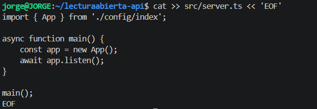

### 2.5.2 `src/config/index.ts` (esqueleto)

> En ISS-01 el App es **esqueleto**. Los imports de modelos, associations, Routes,
> Swagger y el `sync` completo se añaden con **PARCHE** en ISS-02…08.
> El archivo **final** consolidado aparece al cierre de ISS-08.

``
: > src/config/index.ts
cat >> src/config/index.ts << 'EOF'
import dotenv from "dotenv";
import express, { Application } from "express";
import morgan from "morgan";
var cors = require("cors");

dotenv.config();

export class App {
  public app: Application;

  constructor(private port?: number | string) {
    this.app = express();
    this.settings();
    this.middlewares();
    this.routes();
    this.dbConnection();
  }

  private settings(): void {
    this.app.set('port', this.port || process.env.PORT || 4000);
  }

  private middlewares(): void {
    this.app.use(morgan('dev'));
    this.app.use(cors());
    this.app.use(express.json());
    this.app.use(express.urlencoded({ extended: false }));
  }

  private routes(): void {
    // ISS-03 §4.3
  }

  private async dbConnection(): Promise<void> {
    // ISS-02 / ISS-03
  }

  async listen() {
    await this.app.listen(this.app.get('port'));
    console.log(`🚀 Servidor ejecutándose en puerto ${this.app.get('port')}`);
  }
}
EOF

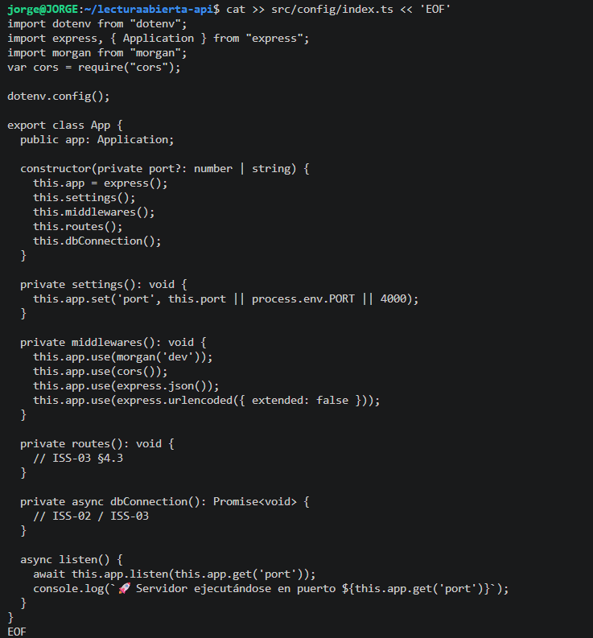

### Verificación del ISS-01

``
npx tsc --noEmit
find src -type f | sort

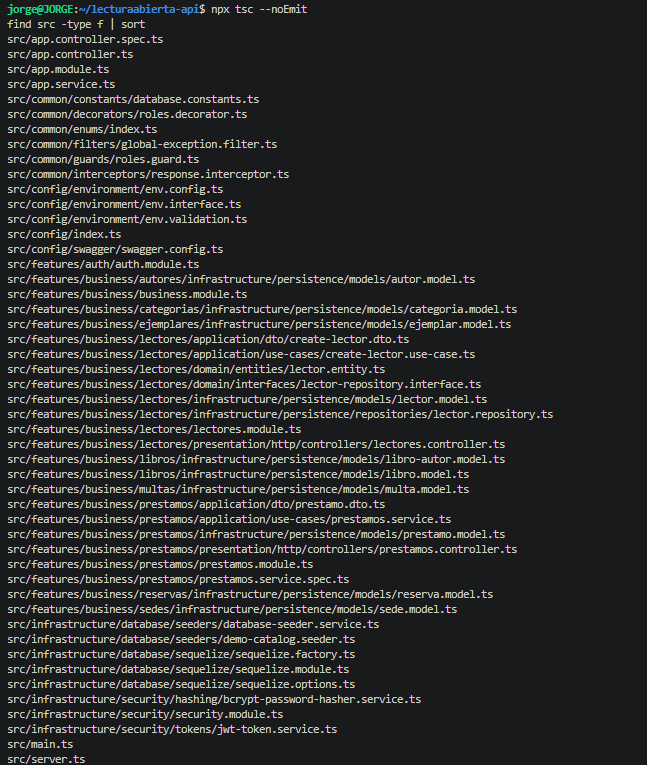

### Cierre del ISS

``
npm run dev
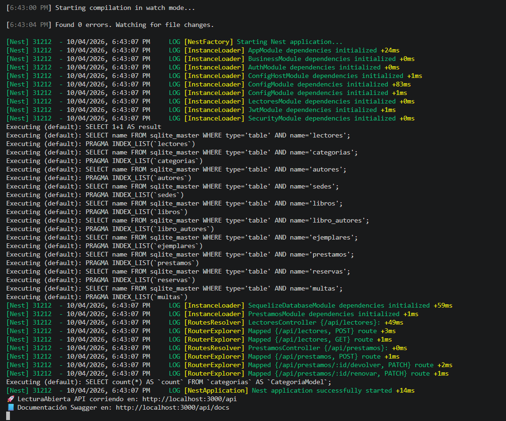

 El servidor debe arrancar sin error. Detenerlo con Ctrl+C antes de continuar.

---

# 3. ISS-02 — Infraestructura de base de datos

**Objetivo:** drivers + `.env` + módulo Sequelize + carpeta `seeders/`.  
**Bloqueado por:** ISS-01.

### Criterios de aceptación (ISS-02) — consolidados

- [ ] **3.1** Paquetes Sequelize/drivers instalados; existe `.env` con `DB_ENGINE` y bloques de motores
- [ ] **3.2** Existe `src/database/db.ts` exportando `sequelize`, `getDatabaseInfo`, `testConnection`
- [ ] **3.3** Existe carpeta `src/database/seeders/` **sin** lógica implementada aún
- [ ] `npx tsc --noEmit` OK

---

## 3.1 Drivers Sequelize y `.env`

**Criterios de este sub-ítem**

- [ ] `sequelize`, `mysql2`, `pg`, `pg-hstore`, `tedious`, `oracledb` instalados
- [ ] `.env` con `PORT`, `DB_ENGINE`, MySQL/Postgres/MSSQL/Oracle

``
npm install sequelize@^6.37.8 mysql2@^3.24.4 pg@^8.23.0 pg-hstore@^2.3.4 \
  tedious@^20.0.0 oracledb@^7.0.1
  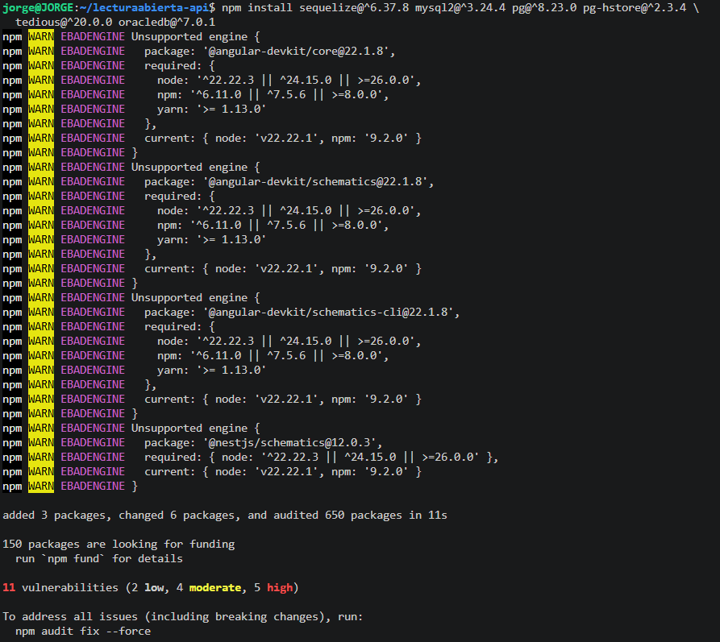
npm install -D @types/sequelize@^6.12.0
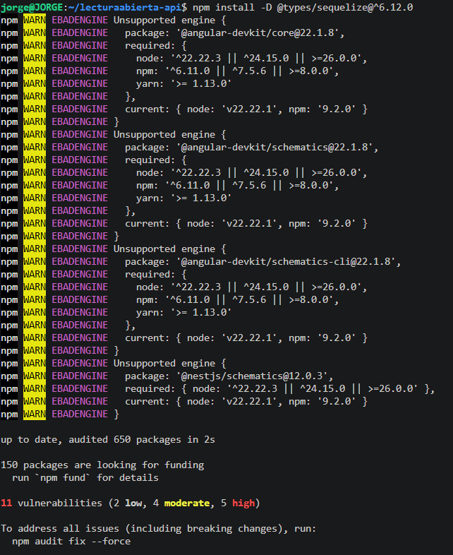

: > .env
cat >> .env << 'EOF'
PORT=4000

# Variable para seleccionar el motor de base de datos
DB_ENGINE=mysql

# Configuración para MySQL
MYSQL_HOST=localhost
MYSQL_USER=admin
MYSQL_PASSWORD=MiNiCo57**
MYSQL_NAME=tecnogua
MYSQL_PORT=3306

# Configuración para PostgreSQL
POSTGRES_HOST=localhost
POSTGRES_USER=postgres
POSTGRES_PASSWORD=password
POSTGRES_NAME=almacen_2025_iisem_node
POSTGRES_PORT=5432

# Configuración para SQL Server
MSSQL_HOST=localhost
MSSQL_USER=sa
MSSQL_PASSWORD=password
MSSQL_NAME=almacen_2025_iisem_node
MSSQL_PORT=1433

# Configuración para Oracle
ORACLE_HOST=localhost
ORACLE_USER=ALMACENDB_ADMIN
ORACLE_PASSWORD=password
ORACLE_NAME=xe
ORACLE_PORT=1521

EOF

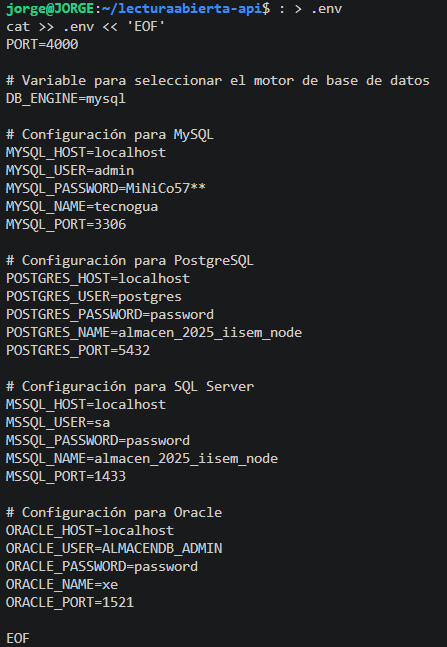

``
test -f .env && grep DB_ENGINE .env
npm ls sequelize mysql2 --depth=0

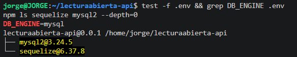

## 3.2 Configuración Sequelize (`database/db.ts`)

**Criterios de este sub-ítem**

- [ ] Archivo `src/database/db.ts` creado
- [ ] Exporta `sequelize`, `getDatabaseInfo`, `testConnection`

``
: > src/database/db.ts
cat >> src/database/db.ts << 'EOF'
import { Sequelize } from "sequelize";
import dotenv from "dotenv";

dotenv.config();

interface DatabaseConfig {
  dialect: string;
  host: string;
  username: string;
  password: string;
  database: string;
  port: number;
}

const dbConfigurations: Record<string, DatabaseConfig> = {
  mysql: {
    dialect: "mysql",
    host: process.env.MYSQL_HOST || "localhost",
    username: process.env.MYSQL_USER || "root",
    password: process.env.MYSQL_PASSWORD || "",
    database: process.env.MYSQL_NAME || "test",
    port: parseInt(process.env.MYSQL_PORT || "3306")
  },
  postgres: {
    dialect: "postgres",
    host: process.env.POSTGRES_HOST || "localhost",
    username: process.env.POSTGRES_USER || "postgres",
    password: process.env.POSTGRES_PASSWORD || "",
    database: process.env.POSTGRES_NAME || "test",
    port: parseInt(process.env.POSTGRES_PORT || "5432")
  }
};

const selectedEngine = process.env.DB_ENGINE || "mysql";
const selectedConfig = dbConfigurations[selectedEngine];

if (!selectedConfig) {
  throw new Error(`Motor de base de datos no soportado: ${selectedEngine}`);
}

console.log(`🔌 Conectando a base de datos: ${selectedEngine.toUpperCase()}`);

export const sequelize = new Sequelize(
  selectedConfig.database,
  selectedConfig.username,
  selectedConfig.password,
  {
    host: selectedConfig.host,
    port: selectedConfig.port,
    dialect: selectedConfig.dialect as any,
    logging: process.env.NODE_ENV === 'development' ? console.log : false,
    pool: {
      max: 5,
      min: 0,
      acquire: 30000,
      idle: 10000
    }
  }
);

export const getDatabaseInfo = () => {
  return {
    engine: selectedEngine,
    config: selectedConfig,
    connectionString: `${selectedConfig.dialect}://${selectedConfig.username}@${selectedConfig.host}:${selectedConfig.port}/${selectedConfig.database}`
  };
};

export const testConnection = async (): Promise<boolean> => {
  try {
    await sequelize.authenticate();
    console.log(`✅ Conexión exitosa a ${selectedEngine.toUpperCase()}`);
    return true;
  } catch (error) {
    console.error(`❌ Error de conexión a ${selectedEngine.toUpperCase()}:`, error);
    return false;
  }
};
EOF

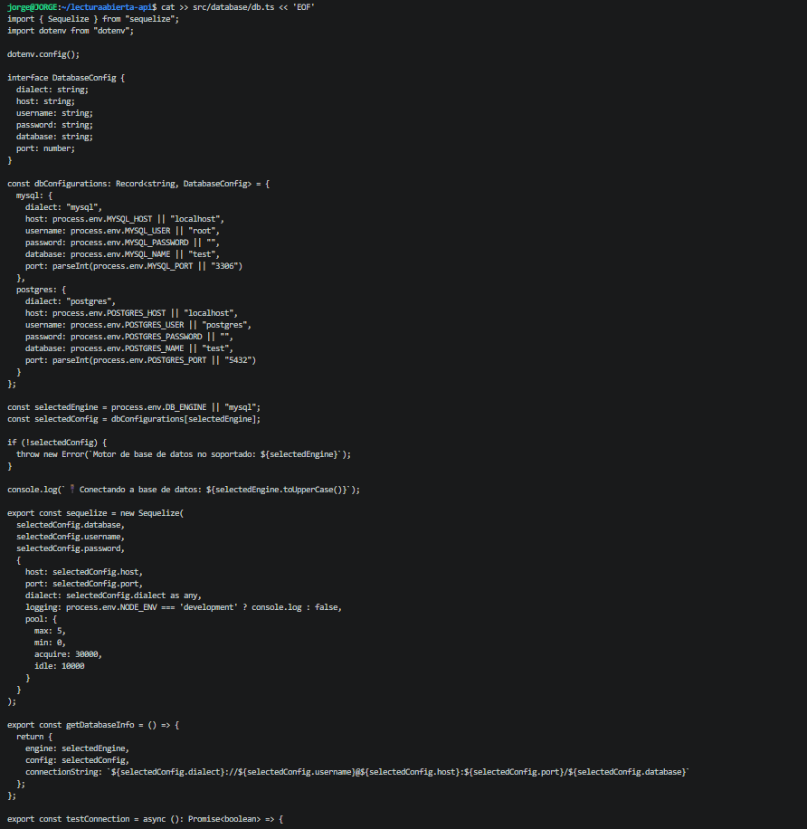

test -f src/database/db.ts && npx tsc --noEmit


## 3.3 Carpeta seeders (reservada)

**Criterios de este sub-ítem**

- [ ] `src/database/seeders/` existe (la lógica llega en ISS-04)
- [ ] `src/database/seeders/` existe **sin** `*.seeder.ts` ni runner

``
mkdir -p src/database/seeders
# opcional: touch src/database/seeders/.gitkeep

test -d src/database/seeders && echo OK

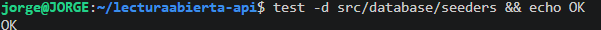
### Verificación del ISS-02

``
npx tsc --noEmit
test -f src/database/db.ts && test -f .env && test -d src/database/seeders

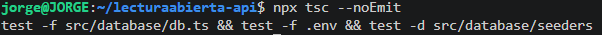

### Cierre del ISS


npm run dev

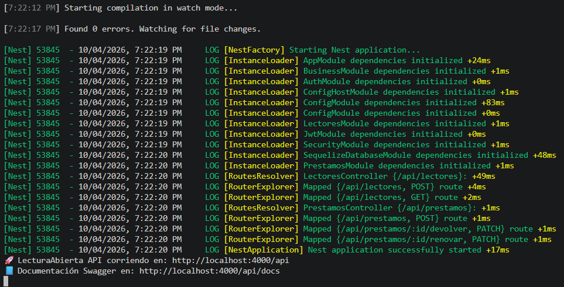

# 4. ISS-03-A — Feature Client — fundación (modelo, esqueleto, HTTP, cableado)

**Nombre recomendado:** *Feature Client — fundación*  
**Objetivo:** dejar el feature listo para CRUD: modelo con columnas obligatorias, esqueleto controller/routes, carpeta `http/`, agregador y sync.  
**Bloqueado por:** ISS-02.

### Criterios de aceptación (ISS-03-A)

- [ ] **4.1** Modelo `client.model.ts` con `status` + `timestamps: true` + bcrypt
- [ ] **4.2** Controller/routes esqueleto (sin CRUD aún en este sub-ítem pedagógico; el repo ya puede tener CRUD de ISS-03-B…E)
- [ ] **4.3** Carpeta `features/business/client/http/` creada
- [ ] **4.4** `routes/index.ts` + `config` importan modelo, conectan BD y hacen `sync`
- [ ] Con BD: `npm run dev` → conexión OK + sync OK + tabla `clients`

---

## 4.1 Modelo Client

**Criterios**

- [ ] `src/features/business/client/client.model.ts`
- [ ] Enum `active`/`inactive`, default `inactive`; `timestamps: true`

npm install bcryptjs@^3.0.3
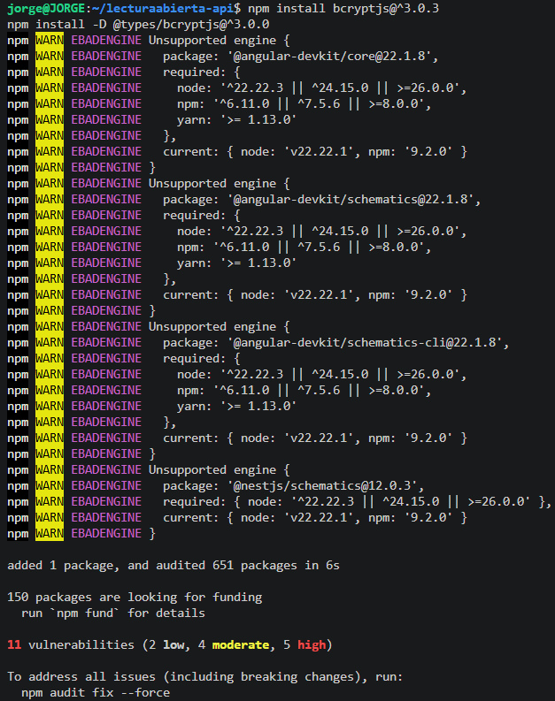
npm install -D @types/bcryptjs@^3.0.0
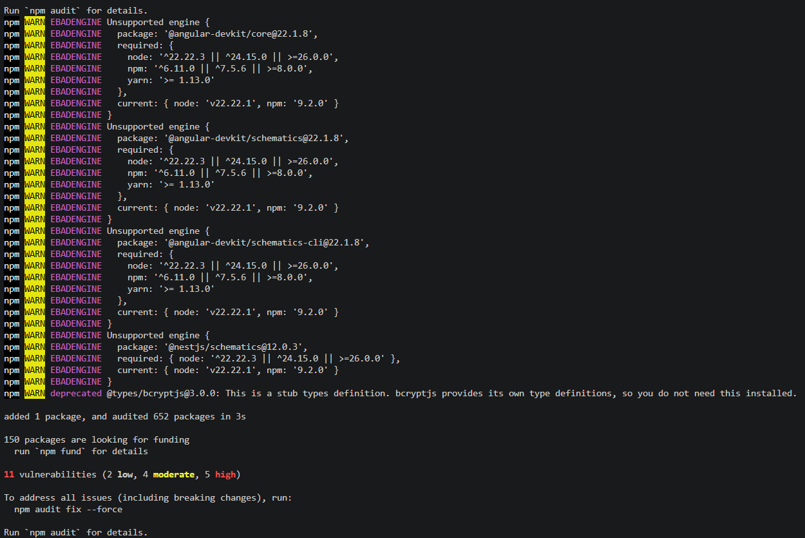

```bash
: > src/features/business/client/client.model.ts
cat >> src/features/business/client/client.model.ts << 'EOF'
import { DataTypes, Model } from "sequelize";
import { sequelize } from "../../../database/db";
import bcrypt from "bcryptjs";

export interface ClientI {
  id?: number;
  name: string;
  address: string;
  phone: string;
  email: string;
  password: string;
  status: "active" | "inactive";
  createdAt?: Date;
  updatedAt?: Date;
}

export class Client extends Model {
  public id!: number;
  public name!: string;
  public address!: string;
  public phone!: string;
  public email!: string;
  public password!: string;
  public status!: "active" | "inactive";
  public readonly createdAt!: Date;
  public readonly updatedAt!: Date;
}

Client.init(
  {
    name: {
      type: DataTypes.STRING,
      allowNull: true,
    },
    address: {
      type: DataTypes.STRING,
      allowNull: true,
    },
    phone: {
      type: DataTypes.STRING,
      allowNull: true,
      validate: {
        notEmpty: { msg: "Phone cannot be empty" },
      },
    },
    email: {
      type: DataTypes.STRING,
      allowNull: true,
      unique: true,
      validate: {
        isEmail: { msg: "Email must be a valid email address" },
      },
    },
    password: {
      type: DataTypes.STRING,
      allowNull: true,
    },
    status: {
      type: DataTypes.ENUM("active", "inactive"),
      defaultValue: "inactive",
      allowNull: false,
    },
  },
  {
    sequelize,
    modelName: "Client",
    tableName: "clients",
    timestamps: true,
    hooks: {
      beforeCreate: async (client: Client) => {
        if (client.password) {
          const salt = await bcrypt.genSalt(10);
          client.password = await bcrypt.hash(client.password, salt);
        }
      },
      beforeUpdate: async (client: Client) => {
        if (client.changed("password") && client.password) {
          const salt = await bcrypt.genSalt(10);
          client.password = await bcrypt.hash(client.password, salt);
        }
      },
      beforeBulkCreate: async (clients: Client[]) => {
        for (const client of clients) {
          if (client.password) {
            const salt = await bcrypt.genSalt(10);
            client.password = await bcrypt.hash(client.password, salt);
          }
        }
      },
    },
  }
);
EOF

## 4.2 Esqueleto controller / routes + carpeta HTTP

**Criterios**

- [ ] Archivos `client.controller.ts` y `client.routes.ts` existen (esqueleto)
- [ ] Carpeta `src/features/business/client/http/` existe

```
mkdir -p src/features/business/client/http

> El CRUD se completa en ISS-03-B…E. Aquí se reserva la carpeta `http/` para archivos `.http` (REST Client) con leyenda **SIN AUTH**.


: > src/features/business/client/client.controller.ts
cat >> src/features/business/client/client.controller.ts << 'EOF'
import { Request, Response } from "express";
import { Client, ClientI } from "./client.model";

function paramId(req: Request): number {
  const raw = req.params.id;
  const value = Array.isArray(raw) ? raw[0] : raw;
  return Number(value);
}

export class ClientController {
  // ================== READ ==================
  // (rellenar en ISS-03-B) getAll, luego getOne

  // ================== CREATE ==================
  // (rellenar en ISS-03-C)

  // ================== UPDATE ==================
  // (rellenar en ISS-03-D)

  // ================== DELETE ==================
  // (rellenar en ISS-03-E)
}
EOF
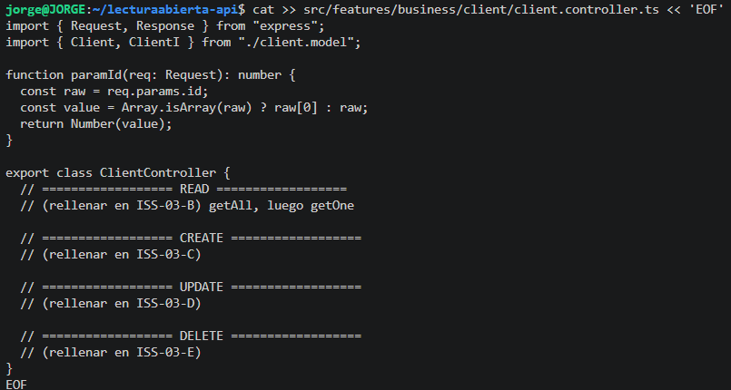


: > src/features/business/client/client.routes.ts
cat >> src/features/business/client/client.routes.ts << 'EOF'
import { Application } from "express";
import { ClientController } from "./client.controller";

export class ClientRoutes {
  public clientController: ClientController = new ClientController();

  public routes(app: Application): void {
    // ================== RUTAS SIN AUTENTICACIÓN / SIN MIDDLEWARE JWT ==================
    // (rellenar en ISS-03-B…E)
  }
}
EOF

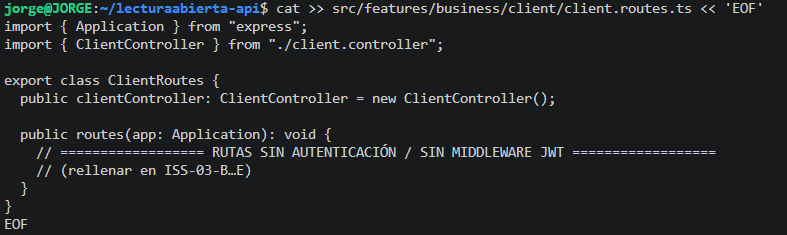

## 4.3 Agregador Routes + cableado en Config

**Criterios**

- [ ] `src/routes/index.ts` con `clientRoutes`
- [ ] `config` importa modelo + `dbConnection` + `routes`

``
: > src/routes/index.ts
cat >> src/routes/index.ts << 'EOF'
import { ClientRoutes } from "../features/business/client/client.routes";

export class Routes {
  public clientRoutes: ClientRoutes = new ClientRoutes();
}
EOF

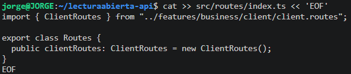

**PARCHE** — `src/config/index.ts` **ya existe** (ISS-01).

1. **Debajo de** `var cors = require("cors");` **añadir**:

```ts
import { sequelize, getDatabaseInfo, testConnection } from "../database/db";
import "../features/business/client/client.model";
import { Routes } from "../routes/index";
```

2. **Dentro de** `export class App`, **debajo de** `public app: Application;` **añadir**:

```ts
  public routePrv: Routes = new Routes();
```

3. **Dentro de** `routes()`, **reemplazar** el comentario `// ISS-03 §4.3` por:

```ts
    this.routePrv.clientRoutes.routes(this.app);
```

4. **Dentro de** `dbConnection()`, **reemplazar** el comentario `// ISS-02 / ISS-03` por:

```ts
    try {
      // Mostrar información de la base de datos seleccionada
      const dbInfo = getDatabaseInfo();
      console.log(`🔗 Intentando conectar a: ${dbInfo.engine.toUpperCase()}`);

      // Probar la conexión
      const isConnected = await testConnection();

      if (!isConnected) {
        throw new Error(`No se pudo conectar a la base de datos ${dbInfo.engine.toUpperCase()}`);
      }

      // alter: true actualiza columnas faltantes (ej. createdAt/updatedAt tras timestamps: true).
      // force: false no recrea tablas; no borra datos. En producción preferir migraciones.
      await sequelize.sync({ force: false, alter: true });
      console.log(`📦 Base de datos sincronizada exitosamente`);
    } catch (error) {
      console.error("❌ Error al conectar con la base de datos:", error);
      process.exit(1); // Terminar la aplicación si no se puede conectar
    }
```

> **Importante (lab):** si la tabla `clients` se creó antes con `timestamps: false`,
> `sync({ force: false })` **no** añade `createdAt`/`updatedAt`. Por eso se usa `alter: true`.

### Verificación ISS-03-A

``
test -d src/features/business/client/http && echo HTTP_FOLDER_OK

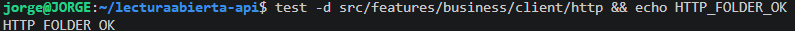

### Cierre del ISS

``
npm run dev

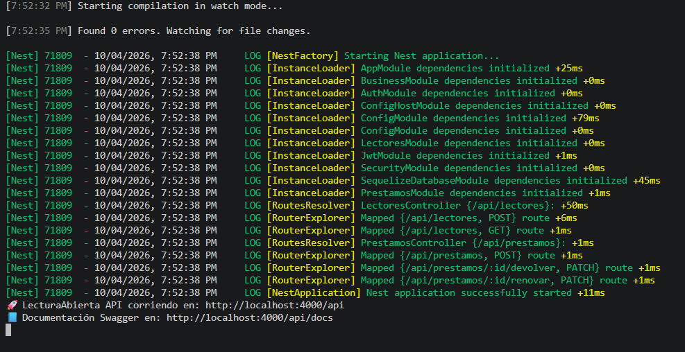

# 5. ISS-03-B — Feature Client — GetAll y GetOne

**Objetivo:** listar activos y obtener uno por id. Es el primer paso del feature: getAll, getOne, luego create, update y delete.  
**Bloqueado por:** ISS-03-A.

### Criterios de aceptación (ISS-03-B)

- [ ] Controller: `getAll` (solo `status: 'active'`) y, debajo, `getOne`
- [ ] Rutas `GET /api/clientes` y `GET /api/clientes/:id` — **sin auth**
- [ ] `http/clients.get.http` con leyenda **SIN AUTH**
- [ ] Respuestas sin campo `password`

### Controller — **PARCHE** `client.controller.ts` (ya existe)

**Debajo de** el comentario `// ================== READ ==================` (y **encima de** `// ================== CREATE ==================`), **añadir** primero `getAll` y después `getOne`:

```ts
  public async getAll(req: Request, res: Response) {
    try {
      const clients = await Client.findAll({
        where: { status: "active" },
        attributes: { exclude: ["password"] },
      });
      res.status(200).json({ clients });
    } catch (error) {
      res.status(500).json({ error: "Error fetching clients", detail: String(error) });
    }
  }

  public async getOne(req: Request, res: Response) {
    try {
      const id = paramId(req);
      const client = await Client.findByPk(id, {
        attributes: { exclude: ["password"] },
      });
      if (!client) {
        res.status(404).json({ error: "Client not found" });
        return;
      }
      res.status(200).json({ client });
    } catch (error) {
      res.status(500).json({ error: "Error fetching client", detail: String(error) });
    }
  }
```

### Rutas — **PARCHE** `client.routes.ts` (ya existe)

**Debajo de** el comentario `// ================== RUTAS SIN AUTENTICACIÓN / SIN MIDDLEWARE JWT ==================`, **añadir** primero `getAll` y después `getOne`:

```ts
    // getAll
    app
      .route("/api/clientes")
      .get(this.clientController.getAll.bind(this.clientController));

    // getOne
    app
      .route("/api/clientes/:id")
      .get(this.clientController.getOne.bind(this.clientController));
```

### HTTP — archivo nuevo

``
: > src/features/business/client/http/clients.get.http
cat >> src/features/business/client/http/clients.get.http << 'EOF'
### Feature Client — GET ALL / GET ONE
### Leyenda: SIN AUTH (sin middleware JWT / sin autenticación)
@baseUrl = http://localhost:4000
@id = 1

# @name getAllClients
GET {{baseUrl}}/api/clientes

###

# @name getOneClient
GET {{baseUrl}}/api/clientes/{{id}}
EOF
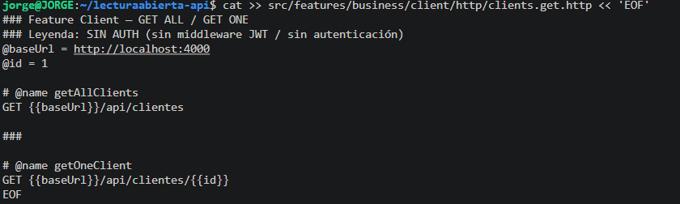

### Verificación

```bash
curl -s http://localhost:4000/api/clientes
curl -s http://localhost:4000/api/clientes/1

### Cierre del ISS

```
npm run dev

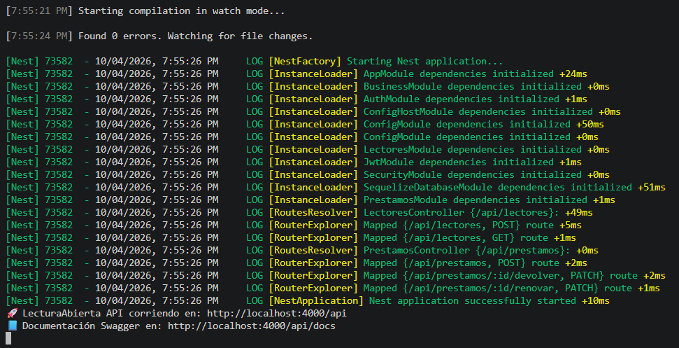

# 6. ISS-03-C — Feature Client — Crear cliente

**Objetivo:** alta de cliente vía API, después de getAll y getOne.  
**Bloqueado por:** ISS-03-B.

### Criterios de aceptación (ISS-03-C)

- [ ] Controller: método `create` **debajo de** `getOne` y **encima de** update
- [ ] Ruta `POST /api/clientes` **debajo de** `getOne` — **sin auth**
- [ ] Archivo `http/clients.create.http` con leyenda **SIN AUTH**
- [ ] `POST` responde `201` con cliente

### Controller — **PARCHE** `client.controller.ts` (ya existe)

**Debajo de** el comentario `// ================== CREATE ==================` (y **encima de** `// ================== UPDATE ==================`), **añadir** el método `create`:

```ts
  public async create(req: Request, res: Response) {
    try {
      const body = req.body as ClientI;
      const client = await Client.create({
        name: body.name,
        address: body.address,
        phone: body.phone,
        email: body.email,
        password: body.password,
        status: body.status ?? "active",
      });
      const { password, ...safe } = client.toJSON() as ClientI & { password?: string };
      res.status(201).json({ client: safe });
    } catch (error) {
      res.status(500).json({ error: "Error creating client", detail: String(error) });
    }
  }
```

### Rutas — **PARCHE** `client.routes.ts` (ya existe)

**Debajo de** el bloque `// getOne`, **añadir**:

```ts
    // create
    app
      .route("/api/clientes")
      .post(this.clientController.create.bind(this.clientController));
```

### HTTP — archivo nuevo

```bash
: > src/features/business/client/http/clients.create.http
cat >> src/features/business/client/http/clients.create.http << 'EOF'
### Feature Client — CREATE
### Leyenda: SIN AUTH (sin middleware JWT / sin autenticación)
@baseUrl = http://localhost:4000

# @name createClient
POST {{baseUrl}}/api/clientes
Content-Type: application/json

{
  "name": "Ana Pérez",
  "address": "Calle 10 #20-30",
  "phone": "3001234567",
  "email": "ana.perez@example.com",
  "password": "Password123!",
  "status": "active"
}
EOF
### Verificación

```
curl -s -X POST http://localhost:4000/api/clientes \
  -H 'Content-Type: application/json' \
  -d '{"name":"Ana","phone":"3001","email":"ana@test.com","password":"Password123!","status":"active"}'

  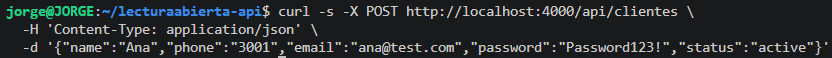

### Cierre del ISS

``
npm run dev

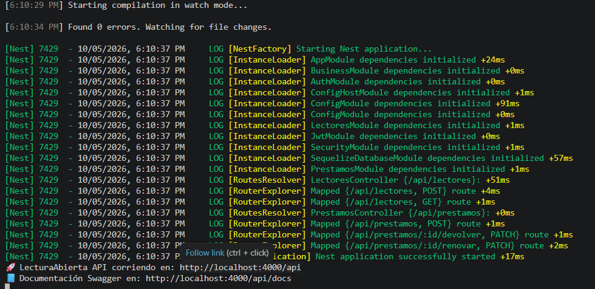

# 7. ISS-03-D — Feature Client — Update (PUT) y Update (PATCH)

**Objetivo:** actualización completa y parcial.  
**Bloqueado por:** ISS-03-C.

### Criterios de aceptación (ISS-03-D)

- [ ] Controller: `updatePut` y `updatePatch`
- [ ] Rutas `PUT` y `PATCH` `/api/clientes/:id` — **sin auth**
- [ ] `http/clients.update.http` con leyenda **SIN AUTH**

### Controller — **PARCHE** `client.controller.ts` (ya existe)

**Debajo de** el comentario `// ================== UPDATE ==================` (y **encima de** `// ================== DELETE ==================`), **añadir**:

```ts
  public async updatePut(req: Request, res: Response) {
    try {
      const id = paramId(req);
      const body = req.body as ClientI;
      const client = await Client.findByPk(id);
      if (!client) {
        res.status(404).json({ error: "Client not found" });
        return;
      }

      await client.update({
        name: body.name,
        address: body.address,
        phone: body.phone,
        email: body.email,
        password: body.password ?? client.password,
        status: body.status ?? client.status,
      });

      const { password, ...safe } = client.toJSON() as ClientI & { password?: string };
      res.status(200).json({ client: safe });
    } catch (error) {
      res.status(500).json({ error: "Error updating client (PUT)", detail: String(error) });
    }
  }

  public async updatePatch(req: Request, res: Response) {
    try {
      const id = paramId(req);
      const body = req.body as Partial<ClientI>;
      const client = await Client.findByPk(id);
      if (!client) {
        res.status(404).json({ error: "Client not found" });
        return;
      }

      await client.update(body);
      const { password, ...safe } = client.toJSON() as ClientI & { password?: string };
      res.status(200).json({ client: safe });
    } catch (error) {
      res.status(500).json({ error: "Error updating client (PATCH)", detail: String(error) });
    }
  }
```

### Rutas — **PARCHE** `client.routes.ts` (ya existe)

**Debajo de** el bloque `// create`, **añadir** PUT y PATCH:

```ts
    // update (PUT / PATCH)
    app
      .route("/api/clientes/:id")
      .put(this.clientController.updatePut.bind(this.clientController))
      .patch(this.clientController.updatePatch.bind(this.clientController));
```

### HTTP — archivo nuevo

``
: > src/features/business/client/http/clients.update.http
cat >> src/features/business/client/http/clients.update.http << 'EOF'
### Feature Client — UPDATE (PUT) / UPDATE (PATCH)
### Leyenda: SIN AUTH (sin middleware JWT / sin autenticación)
@baseUrl = http://localhost:4000
@id = 1

# @name updateClientPut
PUT {{baseUrl}}/api/clientes/{{id}}
Content-Type: application/json

{
  "name": "Ana Pérez Actualizada",
  "address": "Carrera 15 #40-10",
  "phone": "3009876543",
  "email": "ana.perez@example.com",
  "password": "Password123!",
  "status": "active"
}

###

# @name updateClientPatch
PATCH {{baseUrl}}/api/clientes/{{id}}
Content-Type: application/json

{
  "phone": "3011112233",
  "address": "Nueva dirección parcial"
}
EOF

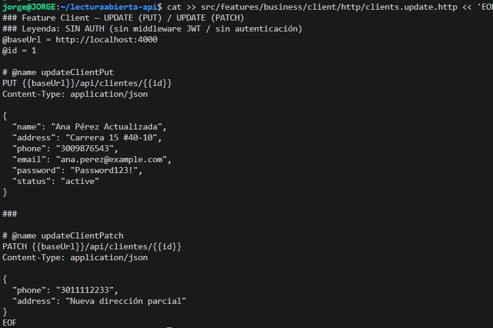
```

### Verificación

```bash
curl -s -X PUT http://localhost:4000/api/clientes/1 -H 'Content-Type: application/json' \
  -d '{"name":"Ana","address":"x","phone":"300","email":"ana@test.com","status":"active"}'
curl -s -X PATCH http://localhost:4000/api/clientes/1 -H 'Content-Type: application/json' \
  -d '{"phone":"301"}'

### Cierre del ISS

```
npm run dev

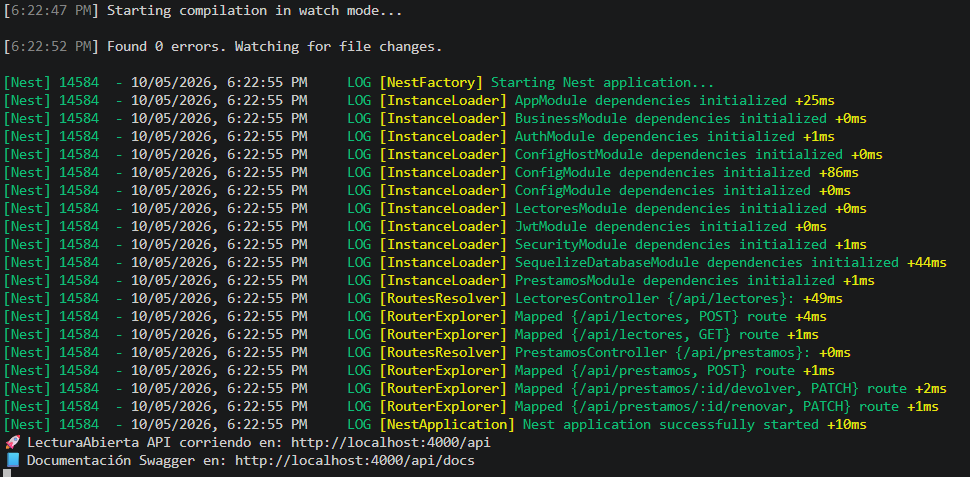

# 8. ISS-03-E — Feature Client — Eliminar (físico y lógico)

**Objetivo:** borrado físico (`DELETE`) y lógico (`status = 'inactive'`).  
**Bloqueado por:** ISS-03-D.

### Criterios de aceptación (ISS-03-E)

- [ ] Controller: `deletePhysical` y `deleteLogical`
- [ ] `DELETE /api/clientes/:id` — físico — **sin auth**
- [ ] `PATCH /api/clientes/:id/deactivate` — lógico → `inactive` — **sin auth**
- [ ] `http/clients.delete.http` con leyenda **SIN AUTH**

### Controller — **PARCHE** `client.controller.ts` (ya existe)

**Debajo de** el comentario `// ================== DELETE ==================`, **añadir** primero el borrado físico y después el lógico:

```ts
  /** Eliminación física */
  public async deletePhysical(req: Request, res: Response) {
    try {
      const id = paramId(req);
      const client = await Client.findByPk(id);
      if (!client) {
        res.status(404).json({ error: "Client not found" });
        return;
      }
      await client.destroy();
      res.status(200).json({ message: "Client permanently deleted", id });
    } catch (error) {
      res.status(500).json({ error: "Error deleting client", detail: String(error) });
    }
  }

  /** Eliminación lógica → status = inactive */
  public async deleteLogical(req: Request, res: Response) {
    try {
      const id = paramId(req);
      const client = await Client.findByPk(id);
      if (!client) {
        res.status(404).json({ error: "Client not found" });
        return;
      }
      await client.update({ status: "inactive" });
      const { password, ...safe } = client.toJSON() as ClientI & { password?: string };
      res.status(200).json({ message: "Client deactivated (logical delete)", client: safe });
    } catch (error) {
      res.status(500).json({ error: "Error deactivating client", detail: String(error) });
    }
  }
```

### Rutas — **PARCHE** `client.routes.ts` (ya existe)

1. **Debajo de** el bloque `// update (PUT / PATCH)`, **añadir** el borrado físico:

```ts
    // delete físico
    app
      .route("/api/clientes/:id")
      .delete(this.clientController.deletePhysical.bind(this.clientController));
```

2. **Debajo de** ese bloque, **añadir** la baja lógica:

```ts
    // delete lógico
    app
      .route("/api/clientes/:id/deactivate")
      .patch(this.clientController.deleteLogical.bind(this.clientController));
```

### HTTP — archivo nuevo

``
: > src/features/business/client/http/clients.delete.http
cat >> src/features/business/client/http/clients.delete.http << 'EOF'
### Feature Client — DELETE físico / DELETE lógico (status = inactive)
### Leyenda: SIN AUTH (sin middleware JWT / sin autenticación)
@baseUrl = http://localhost:4000
@id = 1

# @name deleteClientPhysical
DELETE {{baseUrl}}/api/clientes/{{id}}

###

# @name deleteClientLogical
PATCH {{baseUrl}}/api/clientes/{{id}}/deactivate
EOF

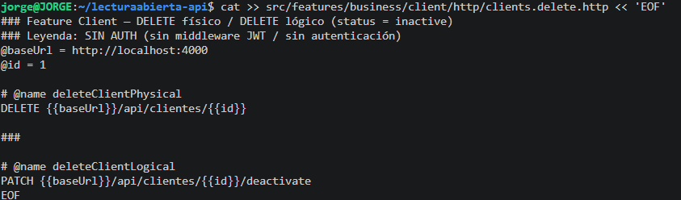

### Verificación

```bash
curl -s -X PATCH http://localhost:4000/api/clientes/1/deactivate
curl -s -X DELETE http://localhost:4000/api/clientes/1

### Estado final Client (CRUD completo) — archivos consolidados

Tras ISS-03-B…E, estos archivos deben quedar así (equivalente a aplicar todos los PARCHE):

```
: > src/features/business/client/client.controller.ts
cat >> src/features/business/client/client.controller.ts << 'EOF'
import { Request, Response } from "express";
import { Client, ClientI } from "./client.model";

function paramId(req: Request): number {
  const raw = req.params.id;
  const value = Array.isArray(raw) ? raw[0] : raw;
  return Number(value);
}

export class ClientController {
  // ================== READ ==================
  public async getAll(req: Request, res: Response) {
    try {
      const clients = await Client.findAll({
        where: { status: "active" },
        attributes: { exclude: ["password"] },
      });
      res.status(200).json({ clients });
    } catch (error) {
      res.status(500).json({ error: "Error fetching clients", detail: String(error) });
    }
  }

  public async getOne(req: Request, res: Response) {
    try {
      const id = paramId(req);
      const client = await Client.findByPk(id, {
        attributes: { exclude: ["password"] },
      });
      if (!client) {
        res.status(404).json({ error: "Client not found" });
        return;
      }
      res.status(200).json({ client });
    } catch (error) {
      res.status(500).json({ error: "Error fetching client", detail: String(error) });
    }
  }

  // ================== CREATE ==================
  public async create(req: Request, res: Response) {
    try {
      const body = req.body as ClientI;
      const client = await Client.create({
        name: body.name,
        address: body.address,
        phone: body.phone,
        email: body.email,
        password: body.password,
        status: body.status ?? "active",
      });
      const { password, ...safe } = client.toJSON() as ClientI & { password?: string };
      res.status(201).json({ client: safe });
    } catch (error) {
      res.status(500).json({ error: "Error creating client", detail: String(error) });
    }
  }

  // ================== UPDATE ==================
  public async updatePut(req: Request, res: Response) {
    try {
      const id = paramId(req);
      const body = req.body as ClientI;
      const client = await Client.findByPk(id);
      if (!client) {
        res.status(404).json({ error: "Client not found" });
        return;
      }

      await client.update({
        name: body.name,
        address: body.address,
        phone: body.phone,
        email: body.email,
        password: body.password ?? client.password,
        status: body.status ?? client.status,
      });

      const { password, ...safe } = client.toJSON() as ClientI & { password?: string };
      res.status(200).json({ client: safe });
    } catch (error) {
      res.status(500).json({ error: "Error updating client (PUT)", detail: String(error) });
    }
  }

  public async updatePatch(req: Request, res: Response) {
    try {
      const id = paramId(req);
      const body = req.body as Partial<ClientI>;
      const client = await Client.findByPk(id);
      if (!client) {
        res.status(404).json({ error: "Client not found" });
        return;
      }

      await client.update(body);
      const { password, ...safe } = client.toJSON() as ClientI & { password?: string };
      res.status(200).json({ client: safe });
    } catch (error) {
      res.status(500).json({ error: "Error updating client (PATCH)", detail: String(error) });
    }
  }

  // ================== DELETE ==================
  /** Eliminación física */
  public async deletePhysical(req: Request, res: Response) {
    try {
      const id = paramId(req);
      const client = await Client.findByPk(id);
      if (!client) {
        res.status(404).json({ error: "Client not found" });
        return;
      }
      await client.destroy();
      res.status(200).json({ message: "Client permanently deleted", id });
    } catch (error) {
      res.status(500).json({ error: "Error deleting client", detail: String(error) });
    }
  }

  /** Eliminación lógica → status = inactive */
  public async deleteLogical(req: Request, res: Response) {
    try {
      const id = paramId(req);
      const client = await Client.findByPk(id);
      if (!client) {
        res.status(404).json({ error: "Client not found" });
        return;
      }
      await client.update({ status: "inactive" });
      const { password, ...safe } = client.toJSON() as ClientI & { password?: string };
      res.status(200).json({ message: "Client deactivated (logical delete)", client: safe });
    } catch (error) {
      res.status(500).json({ error: "Error deactivating client", detail: String(error) });
    }
  }
}
EOF

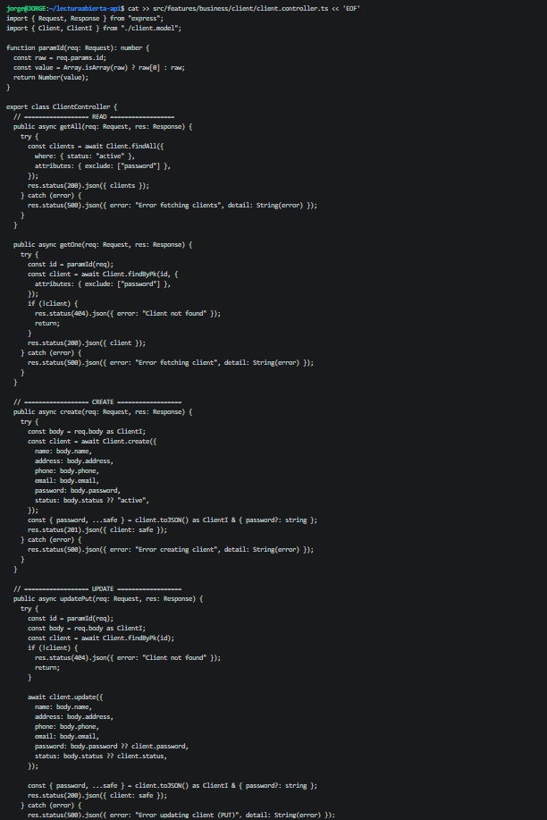
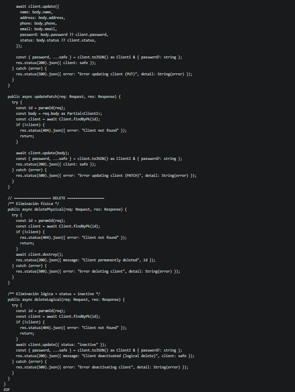

``
: > src/features/business/client/client.routes.ts
cat >> src/features/business/client/client.routes.ts << 'EOF'
import { Application } from "express";
import { ClientController } from "./client.controller";

export class ClientRoutes {
  public clientController: ClientController = new ClientController();

  public routes(app: Application): void {
    // ================== RUTAS SIN AUTENTICACIÓN / SIN MIDDLEWARE JWT ==================

    // getAll
    app
      .route("/api/clientes")
      .get(this.clientController.getAll.bind(this.clientController));

    // getOne
    app
      .route("/api/clientes/:id")
      .get(this.clientController.getOne.bind(this.clientController));

    // create
    app
      .route("/api/clientes")
      .post(this.clientController.create.bind(this.clientController));

    // update (PUT / PATCH)
    app
      .route("/api/clientes/:id")
      .put(this.clientController.updatePut.bind(this.clientController))
      .patch(this.clientController.updatePatch.bind(this.clientController));

    // delete físico
    app
      .route("/api/clientes/:id")
      .delete(this.clientController.deletePhysical.bind(this.clientController));

    // delete lógico
    app
      .route("/api/clientes/:id/deactivate")
      .patch(this.clientController.deleteLogical.bind(this.clientController));
  }
}
EOF

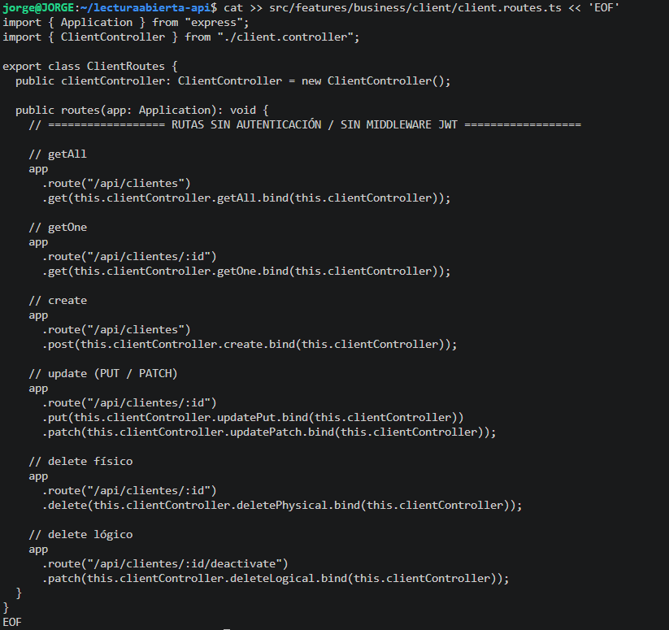

### Cierre del ISS

``
npm run dev

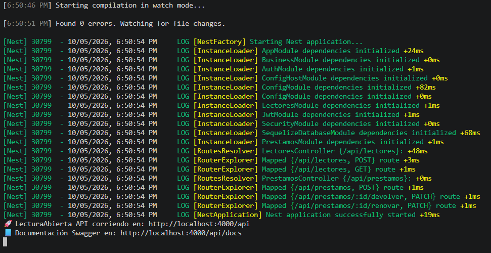

# 9. ISS-04 — Seeders con Faker (feature + runner externo)

**Objetivo:** datos falsos por feature (Faker) y un orquestador externo que ejecuta todos los seeders enviando la **cantidad por entidad**.  
**Bloqueado por:** ISS-03-A (modelo); recomendado tras ISS-03-E.

### Criterios de aceptación (ISS-04) — consolidados

- [ ] **9.1** Existe `features/business/client/client.seeder.ts` con `@faker-js/faker`, recibe `count`, es idempotente
- [ ] **9.2** Existe `database/seeders/index.ts` (SeedersRunner) que llama seeders de features
- [ ] **9.2** Existe `database/seeders/counts.ts` con cantidad por entidad (default / env / CLI)
- [ ] Script `npm run db:seed` funciona
- [ ] Se puede variar cantidad: `npm run db:seed -- --clients=20` o `SEED_CLIENTS=5`

**Diseño**

| Pieza | Ubicación | Rol |
|-------|-----------|-----|
| Seeder del feature | `src/features/business/client/client.seeder.ts` | Genera filas falsas de Client |
| Conteos | `src/database/seeders/counts.ts` | `clients: N` (y futuras entidades) |
| Runner | `src/database/seeders/index.ts` | Importa seeders de features y los ejecuta en orden |

---

## 9.1 Seeder dentro del feature Client

**Criterios**

- [ ] `seedClients(count: number)` exportado desde el feature
- [ ] Usa `@faker-js/faker`
- [ ] Si ya hay filas, no duplica

``
npm install -D @faker-js/faker@^10.6.0

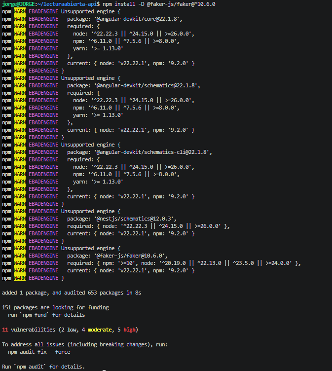

``
: > src/features/business/client/client.seeder.ts
cat >> src/features/business/client/client.seeder.ts << 'EOF'
import { faker } from "@faker-js/faker";
import { Client } from "./client.model";

/**
 * Seeder del feature Client (datos falsos con @faker-js/faker).
 * Se invoca desde `src/database/seeders` (SeedersRunner), no desde la App.
 *
 * Idempotente: si ya hay filas, no vuelve a insertar.
 */
export async function seedClients(count: number): Promise<number> {
  if (count <= 0) {
    console.log("⏭️  clients: count=0, se omite");
    return 0;
  }

  const existing = await Client.count();
  if (existing > 0) {
    console.log(`⏭️  clients: ya hay ${existing} registro(s), se omite seeder`);
    return 0;
  }

  const rows = Array.from({ length: count }, (_, i) => ({
    name: faker.person.fullName(),
    address: faker.location.streetAddress(),
    phone: faker.phone.number({ style: "national" }),
    email: `client.${i}.${faker.string.alphanumeric(6)}@example.com`.toLowerCase(),
    password: "Password123!",
    status: "active" as const,
  }));

  await Client.bulkCreate(rows);
  console.log(`✅ clients: insertados ${count} registro(s) falsos`);
  return count;
}
EOF

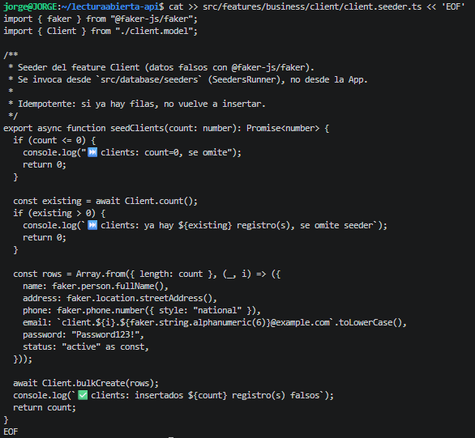

## 9.2 SeedersRunner + conteos por entidad (`database/seeders`)

**Criterios**

- [ ] Runner fuera del feature en `src/database/seeders/`
- [ ] Cantidad configurable por feature (`clients`, …)

### 9.2.1 Conteos

``
: > src/database/seeders/counts.ts
cat >> src/database/seeders/counts.ts << 'EOF'
/**
 * Cantidad de registros por feature/entidad.
 * Prioridad: CLI (--clients=N) > env (SEED_CLIENTS) > default de este archivo.
 *
 * Cuando agregues features, suma aquí la clave y léela en el runner.
 */
export type SeedCounts = {
  clients: number;
  // users?: number;
  // roles?: number;
  // products?: number;
};

export const DEFAULT_SEED_COUNTS: SeedCounts = {
  clients: 10,
};

export function resolveSeedCounts(argv: string[] = process.argv.slice(2)): SeedCounts {
  const counts: SeedCounts = { ...DEFAULT_SEED_COUNTS };

  const envClients = process.env.SEED_CLIENTS;
  if (envClients !== undefined && envClients !== "") {
    counts.clients = Number(envClients);
  }

  for (const arg of argv) {
    const m = arg.match(/^--([a-zA-Z_]+)=(\d+)$/);
    if (!m) continue;
    const key = m[1] as keyof SeedCounts;
    const value = Number(m[2]);
    if (key in counts) {
      counts[key] = value;
    }
  }

  return counts;
}
EOF

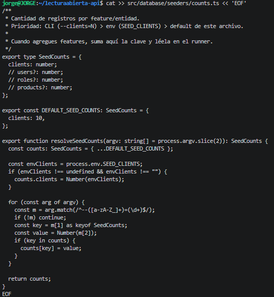

### 9.2.2 Runner

``
: > src/database/seeders/index.ts
cat >> src/database/seeders/index.ts << 'EOF'
import dotenv from "dotenv";
import { sequelize, testConnection } from "../db";
import "../../features/business/client/client.model";
import { seedClients } from "../../features/business/client/client.seeder";
import { resolveSeedCounts } from "./counts";

dotenv.config();

/**
 * SeedersRunner — ejecuta TODOS los seeders de features.
 *
 * Ubicación: `src/database/seeders/` (orquestación fuera de cada feature).
 * Cada feature exporta su seeder (ej. `features/business/client/client.seeder.ts`).
 *
 * Uso:
 *   npm run db:seed
 *   npm run db:seed -- --clients=20
 *   SEED_CLIENTS=5 npm run db:seed
 */
export async function runAllSeeders(): Promise<void> {
  const counts = resolveSeedCounts();
  console.log("🌱 Iniciando SeedersRunner...");
  console.log("📊 Conteos:", counts);

  const ok = await testConnection();
  if (!ok) {
    throw new Error("No hay conexión a la base de datos");
  }

  await sequelize.sync({ force: false, alter: true });

  // Orden: business (padres → hijos)
  await seedClients(counts.clients);

  console.log("🌱 SeedersRunner finalizado");
}

if (require.main === module) {
  runAllSeeders()
    .then(async () => {
      await sequelize.close();
      process.exit(0);
    })
    .catch(async (err) => {
      console.error("❌ Error en seeders:", err);
      await sequelize.close();
      process.exit(1);
    });
}
EOF

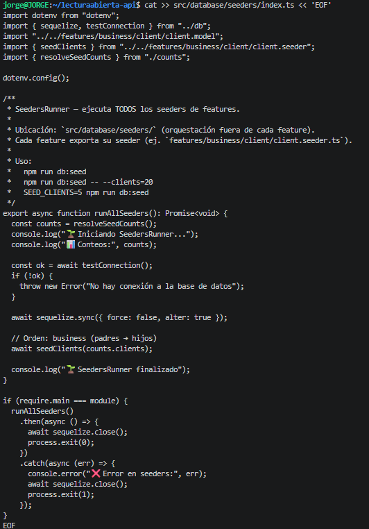

**PARCHE** — `package.json` **ya existe**.

**Dentro de** `"scripts"`, **debajo de** `"dev": "..."`, **añadir** la coma al final de `dev` (si falta) y la clave:

```json
    "db:seed": "ts-node -- src/database/seeders/index.ts"
```

Fragmento esperado:

```json
  "scripts": {
    "build": "tsc",
    "dev": "nodemon --watch src --ext ts --exec ts-node -- src/server.ts",
    "db:seed": "ts-node -- src/database/seeders/index.ts"
  }
```

### Verificación ISS-04

``
npm run db:seed
npm run db:seed -- --clients=20
SEED_CLIENTS=5 npm run db:seed

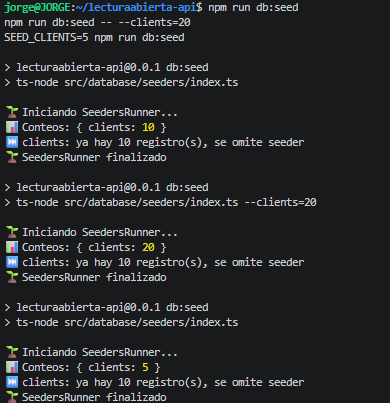

**Al agregar otra entidad (patrón):**

1. Archivo **nuevo** `features/.../<entidad>.seeder.ts` con `: >` + `cat >>`.
2. **PARCHE** `counts.ts`: **dentro de** `SeedCounts` / defaults, **añadir** clave (ej. `products: 10`).
3. **PARCHE** `database/seeders/index.ts`: **debajo de** `await seedClients(...)`, **añadir** la llamada al nuevo seeder.

### Cierre del ISS

``
npm run dev
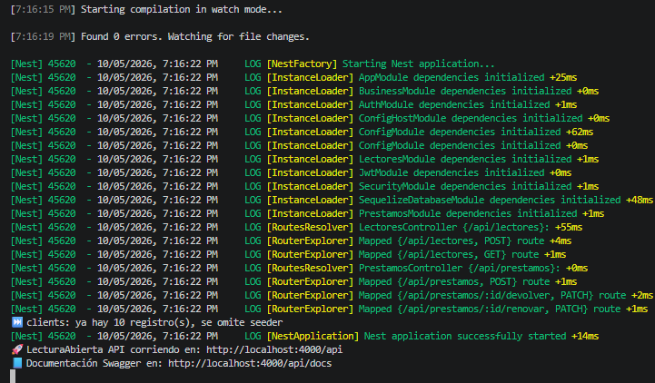

# 10. ISS-05 — Swagger / OpenAPI (feature + registry externo)

**Objetivo:** documentar el API del feature Client en OpenAPI 3 y montar Swagger UI desde un **registry externo** (mismo patrón que seeders).  
**Bloqueado por:** ISS-03-E (rutas CRUD definidas).

### Criterios de aceptación (ISS-05) — consolidados

- [ ] **10.1** Existe `features/business/client/client.swagger.ts` con tags, paths y schemas de Client (leyenda **SIN AUTH**)
- [ ] **10.2** Existe `src/swagger/index.ts` que agrega módulos de features y monta UI
- [ ] `App` llama `setupSwagger` (método `docs()`)
- [ ] `GET /api/docs` muestra Swagger UI
- [ ] `GET /api/docs.json` devuelve el documento OpenAPI

**Diseño**

| Pieza | Ubicación | Rol |
|-------|-----------|-----|
| Docs del feature | `src/features/business/client/client.swagger.ts` | Paths + schemas Client |
| Registry | `src/swagger/index.ts` | Fusiona features + `setupSwagger(app)` |
| UI | `/api/docs` | Swagger UI |
| Spec | `/api/docs.json` | OpenAPI JSON |

---

## 10.1 OpenAPI dentro del feature Client

**Criterios**

- [ ] Exporta `clientSwagger` con `tags`, `paths`, `components.schemas`
- [ ] Endpoints documentados como **SIN AUTH**

``
# Paquetes (una vez)
npm install swagger-ui-express@^5.0.1

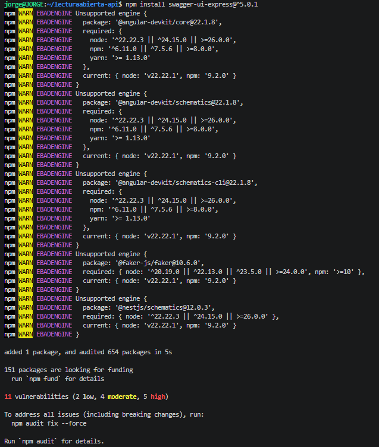

npm install -D @types/swagger-ui-express@^4.1.8

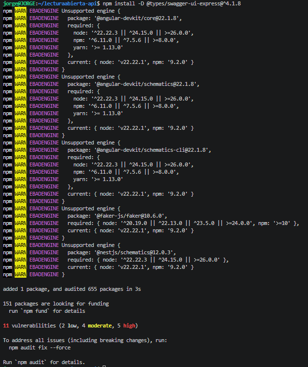

Archivo **nuevo**:

```bash
: > src/features/business/client/client.swagger.ts
cat >> src/features/business/client/client.swagger.ts << 'EOF'
/**
 * Documentación OpenAPI del feature Client.
 * Se agrega desde `src/swagger` (registry externo), no se monta aquí.
 *
 * Leyenda: endpoints documentados como SIN AUTH (sin middleware JWT).
 */

export const clientSwagger = {
  tags: [
    {
      name: "Clientes",
      description: "CRUD de clientes — **SIN AUTH** (sin middleware JWT)",
    },
  ],
  paths: {
    "/api/clientes": {
      get: {
        tags: ["Clientes"],
        summary: "Listar clientes activos",
        description: "SIN AUTH — retorna clientes con status=active (sin password)",
        security: [],
        responses: {
          "200": {
            description: "Lista de clientes",
            content: {
              "application/json": {
                schema: {
                  type: "object",
                  properties: {
                    clients: {
                      type: "array",
                      items: { $ref: "#/components/schemas/Client" },
                    },
                  },
                },
              },
            },
          },
        },
      },
      post: {
        tags: ["Clientes"],
        summary: "Crear cliente",
        description: "SIN AUTH",
        security: [],
        requestBody: {
          required: true,
          content: {
            "application/json": {
              schema: { $ref: "#/components/schemas/ClientCreate" },
            },
          },
        },
        responses: {
          "201": {
            description: "Cliente creado",
            content: {
              "application/json": {
                schema: {
                  type: "object",
                  properties: {
                    client: { $ref: "#/components/schemas/Client" },
                  },
                },
              },
            },
          },
        },
      },
    },
    "/api/clientes/{id}": {
      get: {
        tags: ["Clientes"],
        summary: "Obtener cliente por id",
        description: "SIN AUTH",
        security: [],
        parameters: [
          {
            name: "id",
            in: "path",
            required: true,
            schema: { type: "integer" },
          },
        ],
        responses: {
          "200": {
            description: "Cliente encontrado",
            content: {
              "application/json": {
                schema: {
                  type: "object",
                  properties: {
                    client: { $ref: "#/components/schemas/Client" },
                  },
                },
              },
            },
          },
          "404": { description: "No encontrado" },
        },
      },
      put: {
        tags: ["Clientes"],
        summary: "Actualizar cliente (PUT — reemplazo)",
        description: "SIN AUTH",
        security: [],
        parameters: [
          {
            name: "id",
            in: "path",
            required: true,
            schema: { type: "integer" },
          },
        ],
        requestBody: {
          required: true,
          content: {
            "application/json": {
              schema: { $ref: "#/components/schemas/ClientUpdate" },
            },
          },
        },
        responses: {
          "200": { description: "Actualizado" },
          "404": { description: "No encontrado" },
        },
      },
      patch: {
        tags: ["Clientes"],
        summary: "Actualizar cliente (PATCH — parcial)",
        description: "SIN AUTH",
        security: [],
        parameters: [
          {
            name: "id",
            in: "path",
            required: true,
            schema: { type: "integer" },
          },
        ],
        requestBody: {
          required: true,
          content: {
            "application/json": {
              schema: { $ref: "#/components/schemas/ClientPatch" },
            },
          },
        },
        responses: {
          "200": { description: "Actualizado" },
          "404": { description: "No encontrado" },
        },
      },
      delete: {
        tags: ["Clientes"],
        summary: "Eliminar cliente (físico)",
        description: "SIN AUTH — borra la fila",
        security: [],
        parameters: [
          {
            name: "id",
            in: "path",
            required: true,
            schema: { type: "integer" },
          },
        ],
        responses: {
          "200": { description: "Eliminado" },
          "404": { description: "No encontrado" },
        },
      },
    },
    "/api/clientes/{id}/deactivate": {
      patch: {
        tags: ["Clientes"],
        summary: "Eliminar cliente (lógico)",
        description: "SIN AUTH — status = inactive",
        security: [],
        parameters: [
          {
            name: "id",
            in: "path",
            required: true,
            schema: { type: "integer" },
          },
        ],
        responses: {
          "200": { description: "Desactivado" },
          "404": { description: "No encontrado" },
        },
      },
    },
  },
  components: {
    schemas: {
      Client: {
        type: "object",
        properties: {
          id: { type: "integer", example: 1 },
          name: { type: "string", example: "Ana Pérez" },
          address: { type: "string", example: "Calle 10 #20-30" },
          phone: { type: "string", example: "3001234567" },
          email: { type: "string", format: "email", example: "ana@example.com" },
          status: { type: "string", enum: ["active", "inactive"], example: "active" },
          createdAt: { type: "string", format: "date-time" },
          updatedAt: { type: "string", format: "date-time" },
        },
      },
      ClientCreate: {
        type: "object",
        required: ["name", "phone", "email", "password"],
        properties: {
          name: { type: "string" },
          address: { type: "string" },
          phone: { type: "string" },
          email: { type: "string", format: "email" },
          password: { type: "string", format: "password" },
          status: { type: "string", enum: ["active", "inactive"], default: "active" },
        },
      },
      ClientUpdate: {
        type: "object",
        required: ["name", "phone", "email"],
        properties: {
          name: { type: "string" },
          address: { type: "string" },
          phone: { type: "string" },
          email: { type: "string", format: "email" },
          password: { type: "string", format: "password" },
          status: { type: "string", enum: ["active", "inactive"] },
        },
      },
      ClientPatch: {
        type: "object",
        properties: {
          name: { type: "string" },
          address: { type: "string" },
          phone: { type: "string" },
          email: { type: "string", format: "email" },
          password: { type: "string", format: "password" },
          status: { type: "string", enum: ["active", "inactive"] },
        },
      },
    },
  },
};
EOF

## 10.2 Registry externo + montaje en Config

**Criterios**

- [ ] `buildOpenApiDocument()` fusiona módulos de features
- [ ] `setupSwagger(app)` monta `/api/docs` y `/api/docs.json`
- [ ] `config` invoca `setupSwagger` (método `docs()`)

```bash
mkdir -p src/swagger

Archivo **nuevo**:

```bash
: > src/swagger/index.ts
cat >> src/swagger/index.ts << 'EOF'
import { Application } from "express";
import swaggerUi from "swagger-ui-express";
import { clientSwagger } from "../features/business/client/client.swagger";

export type FeatureSwaggerModule = {
  tags: unknown[];
  paths: Record<string, unknown>;
  components?: { schemas?: Record<string, unknown> };
};

/**
 * Registry externo: importa la documentación OpenAPI de cada feature
 * (mismo patrón que SeedersRunner).
 */
const featureSwaggerModules: FeatureSwaggerModule[] = [
  clientSwagger,
  // productSwagger,
  // userSwagger,
];

export function buildOpenApiDocument() {
  const tags: unknown[] = [];
  const paths: Record<string, unknown> = {};
  const schemas: Record<string, unknown> = {};

  for (const mod of featureSwaggerModules) {
    tags.push(...mod.tags);
    Object.assign(paths, mod.paths);
    if (mod.components?.schemas) {
      Object.assign(schemas, mod.components.schemas);
    }
  }

  return {
    openapi: "3.0.3",
    info: {
      title: "StoreLab API",
      version: "1.0.0",
      description:
        "API StoreLab (Express + Sequelize). Los endpoints de Client están documentados como **SIN AUTH** Todas las rutas business son **SIN AUTH** en este lab.",
    },
    servers: [
      {
        url: `http://localhost:${process.env.PORT || 4000}`,
        description: "Local",
      },
    ],
    tags,
    paths,
    components: { schemas },
  };
}

/** Monta Swagger UI y el JSON OpenAPI */
export function setupSwagger(app: Application): void {
  const document = buildOpenApiDocument();
  app.use("/api/docs", swaggerUi.serve, swaggerUi.setup(document));
  app.get("/api/docs.json", (_req, res) => {
    res.json(document);
  });
  console.log("📘 Swagger UI: /api/docs  |  OpenAPI JSON: /api/docs.json");
}
EOF

**PARCHE** — `src/config/index.ts` **ya existe**.

1. **Debajo de** `import { Routes } from "../routes/index";` (o **debajo de** los imports de BD/modelo), **añadir**:

```ts
import { setupSwagger } from "../swagger/index";
```

2. **Dentro del** `constructor`, **debajo de** `this.routes();` y **encima de** `this.dbConnection();`, **añadir**:

```ts
    this.docs();
```

3. **Dentro de** la clase `App`, **debajo de** el método `routes()` y **encima de** `dbConnection()`, **añadir**:

```ts
  private docs(): void {
    setupSwagger(this.app);
  }
```

### Verificación ISS-05

```bash
curl -s http://localhost:4000/api/docs.json | head

**Al agregar otra entidad (patrón):**

1. Archivo **nuevo** `features/.../<entidad>.swagger.ts` con `: >` + `cat >>`.
2. **PARCHE** `src/swagger/index.ts`: **debajo de** `import { clientSwagger } ...`, **añadir** el import; **dentro de** `featureSwaggerModules`, **debajo de** `clientSwagger,`, **añadir** el módulo nuevo.

### Cierre del ISS

```
npm run dev

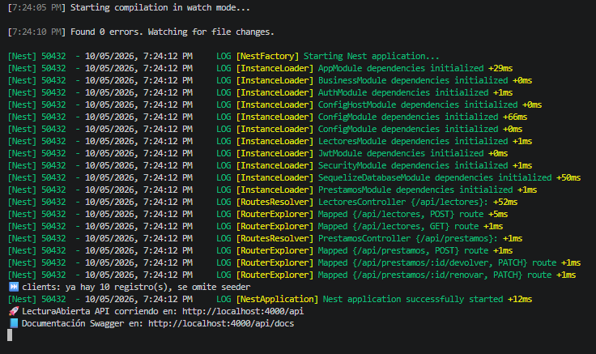

# 11. ISS-06 — Feature ProductType (tipos de producto)

**Objetivo:** CRUD + seeder + swagger de ProductType (sin FK).  
**Bloqueado por:** ISS-05.  
**API:** `/api/tipos-producto` — **SIN AUTH**.  
**Patrón:** mismo que Client (ISS-03-A…E + 04 + 05).

### Criterios de aceptación (ISS-06)

- [ ] **11.1** Modelo `product-type.model.ts` (`status` + `timestamps: true`)
- [ ] **11.2** Controller + routes en este orden: getAll, getOne, create, update PUT/PATCH, delete físico y lógico
- [ ] **11.3** Carpeta `http/` en el mismo orden: get, create, update, delete
- [ ] **11.4** Cableado en `routes/index.ts` + `config` (import model + route)
- [ ] **11.5** Seeder + registro en SeedersRunner / counts
- [ ] **11.6** Swagger + registro en `src/swagger`

### DTOs de Categoría

mkdir -p src/features/business/categorias/presentation/dto
cat <<'EOF' > src/features/business/categorias/presentation/dto/create-categoria.dto.ts
import { ApiProperty } from '@nestjs/swagger';
import { IsNotEmpty, IsOptional, IsString } from 'class-validator';

export class CreateCategoriaDto {
  @ApiProperty({ example: 'Ciencia Ficción' })
  @IsString()
  @IsNotEmpty()
  nombre: string;

  @ApiProperty({ example: 'Novelas y relatos futuristas', required: false })
  @IsString()
  @IsOptional()
  descripcion?: string;
}
EOF

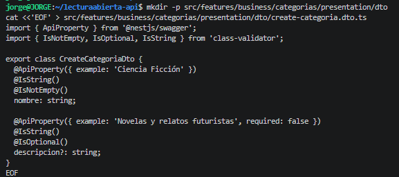

cat <<'EOF' > src/features/business/categorias/presentation/dto/update-categoria.dto.ts
import { ApiProperty } from '@nestjs/swagger';
import { IsOptional, IsString, IsBoolean } from 'class-validator';

export class UpdateCategoriaDto {
  @ApiProperty({ example: 'Ciencia Ficción Clásica', required: false })
  @IsString()
  @IsOptional()
  nombre?: string;

  @ApiProperty({ example: 'Nueva descripción', required: false })
  @IsString()
  @IsOptional()
  descripcion?: string;

  @ApiProperty({ example: true, required: false })
  @IsBoolean()
  @IsOptional()
  is_active?: boolean;
}
EOF

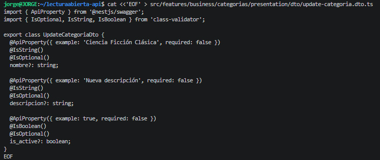

### Servicio de Aplicación

mkdir -p src/features/business/categorias/application/use-cases
cat <<'EOF' > src/features/business/categorias/application/use-cases/categorias.service.ts
import { Injectable, NotFoundException } from '@nestjs/common';
import { CategoriaModel } from '../infrastructure/persistence/models/categoria.model';
import { CreateCategoriaDto } from '../../presentation/dto/create-categoria.dto';
import { UpdateCategoriaDto } from '../../presentation/dto/update-categoria.dto';

@Injectable()
export class CategoriasService {
  async getAll() {
    return CategoriaModel.findAll({ where: { is_active: true } });
  }

  async getOne(id: number) {
    const categoria = await CategoriaModel.findByPk(id);
    if (!categoria) throw new NotFoundException(`Categoría con id ${id} no encontrada`);
    return categoria;
  }

  async create(dto: CreateCategoriaDto) {
    return CategoriaModel.create({
      nombre: dto.nombre,
      descripcion: dto.descripcion ?? null,
      is_active: true,
    });
  }

  async updatePut(id: number, dto: CreateCategoriaDto) {
    const categoria = await this.getOne(id);
    await categoria.update({
      nombre: dto.nombre,
      descripcion: dto.descripcion ?? null,
    });
    return categoria;
  }

  async updatePatch(id: number, dto: UpdateCategoriaDto) {
    const categoria = await this.getOne(id);
    await categoria.update(dto);
    return categoria;
  }

  async deletePhysical(id: number) {
    const categoria = await this.getOne(id);
    await categoria.destroy();
    return { message: 'Categoría eliminada permanentemente', id };
  }

  async deleteLogical(id: number) {
    const categoria = await this.getOne(id);
    await categoria.update({ is_active: false });
    return { message: 'Categoría desactivada (borrado lógico)', categoria };
  }
}
EOF

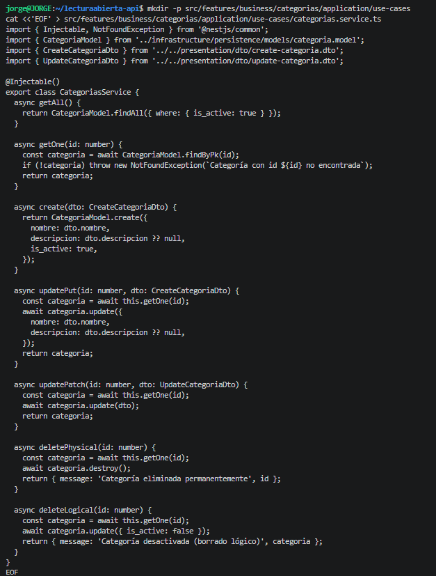

### Controlador de Categorías (CategoriasController - SIN AUTH)

mkdir -p src/features/business/categorias/presentation/controllers
cat <<'EOF' > src/features/business/categorias/presentation/controllers/categorias.controller.ts
import { Controller, Get, Post, Put, Patch, Delete, Param, Body, ParseIntPipe } from '@nestjs/common';
import { ApiTags, ApiOperation } from '@nestjs/swagger';
import { CategoriasService } from '../../application/use-cases/categorias.service';
import { CreateCategoriaDto } from '../dto/create-categoria.dto';
import { UpdateCategoriaDto } from '../dto/update-categoria.dto';

@ApiTags('Categorias')
@Controller('categorias')
export class CategoriasController {
  constructor(private readonly service: CategoriasService) {}

  @Get()
  @ApiOperation({ summary: 'Listar categorías activas (SIN AUTH)' })
  getAll() {
    return this.service.getAll();
  }

  @Get(':id')
  @ApiOperation({ summary: 'Obtener categoría por ID (SIN AUTH)' })
  getOne(@Param('id', ParseIntPipe) id: number) {
    return this.service.getOne(id);
  }

  @Post()
  @ApiOperation({ summary: 'Crear categoría (SIN AUTH)' })
  create(@Body() dto: CreateCategoriaDto) {
    return this.service.create(dto);
  }

  @Put(':id')
  @ApiOperation({ summary: 'Actualización total PUT (SIN AUTH)' })
  updatePut(@Param('id', ParseIntPipe) id: number, @Body() dto: CreateCategoriaDto) {
    return this.service.updatePut(id, dto);
  }

  @Patch(':id')
  @ApiOperation({ summary: 'Actualización parcial PATCH (SIN AUTH)' })
  updatePatch(@Param('id', ParseIntPipe) id: number, @Body() dto: UpdateCategoriaDto) {
    return this.service.updatePatch(id, dto);
  }

  @Delete(':id')
  @ApiOperation({ summary: 'Eliminación física (SIN AUTH)' })
  deletePhysical(@Param('id', ParseIntPipe) id: number) {
    return this.service.deletePhysical(id);
  }

  @Patch(':id/deactivate')
  @ApiOperation({ summary: 'Eliminación lógica (SIN AUTH)' })
  deleteLogical(@Param('id', ParseIntPipe) id: number) {
    return this.service.deleteLogical(id);
  }
}
EOF

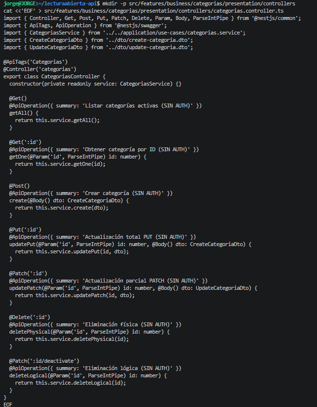

### Módulo de Categorías (CategoriasModule)

cat <<'EOF' > src/features/business/categorias/categorias.module.ts
import { Module } from '@nestjs/common';
import { CategoriasController } from './presentation/controllers/categorias.controller';
import { CategoriasService } from './application/use-cases/categorias.service';

@Module({
  controllers: [CategoriasController],
  providers: [CategoriasService],
  exports: [CategoriasService],
})
export class CategoriasModule {}
EOF

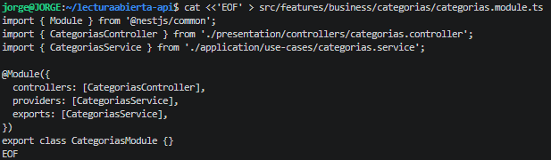

### Cierre del ISS

``
npm run dev

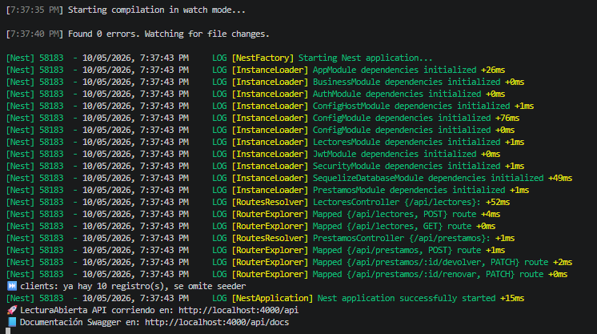

### ISS-07: Feature Libros con Relación a Categoria (Análogo a Product)

**Objetivo:** CRUD de Product con FK `product_type_id`.  
**Bloqueado por:** ISS-06.  
**API:** `/api/productos` — **SIN AUTH**.

### Criterios de aceptación (ISS-07)

- [ ] **12.1** Modelo Product con `product_type_id`
- [ ] **12.2** Controller valida tipo **activo** en create/updatePut
- [ ] **12.3** Routes + http/ en orden getAll, getOne, create, update PUT/PATCH, delete físico y lógico
- [ ] **12.4** Cableado routes/config
- [ ] **12.5** **Relaciones** Product ↔ ProductType (archivo associations + import)
- [ ] **12.6** Seeder + swagger

## DTOs de Libros

mkdir -p src/features/business/libros/presentation/dto
cat <<'EOF' > src/features/business/libros/presentation/dto/create-libro.dto.ts
import { ApiProperty } from '@nestjs/swagger';
import { IsNotEmpty, IsNumber, IsOptional, IsString } from 'class-validator';

export class CreateLibroDto {
  @ApiProperty({ example: 'Cien Años de Soledad' })
  @IsString()
  @IsNotEmpty()
  nombre: string;

  @ApiProperty({ example: 'Edición conmemorativa', required: false })
  @IsString()
  @IsOptional()
  descripcion?: string;

  @ApiProperty({ example: 1 })
  @IsNumber()
  @IsNotEmpty()
  categoria_id: number;
}
EOF

cat <<'EOF' > src/features/business/libros/presentation/dto/update-libro.dto.ts
import { ApiProperty } from '@nestjs/swagger';
import { IsOptional, IsString, IsNumber, IsBoolean } from 'class-validator';

export class UpdateLibroDto {
  @ApiProperty({ example: 'Cien Años de Soledad (Edición 2)', required: false })
  @IsString()
  @IsOptional()
  nombre?: string;

  @ApiProperty({ example: 'Actualización de notas', required: false })
  @IsString()
  @IsOptional()
  descripcion?: string;

  @ApiProperty({ example: 1, required: false })
  @IsNumber()
  @IsOptional()
  categoria_id?: number;

  @ApiProperty({ example: true, required: false })
  @IsBoolean()
  @IsOptional()
  is_active?: boolean;
}
EOF

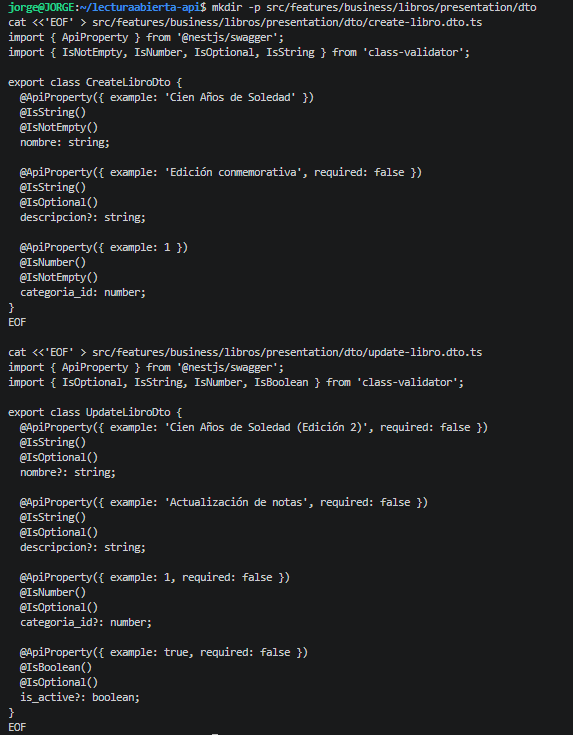

## Servicio de Libros con Verificación de Categoría Activa

mkdir -p src/features/business/libros/application/use-cases
cat <<'EOF' > src/features/business/libros/application/use-cases/libros.service.ts
import { Injectable, NotFoundException, BadRequestException } from '@nestjs/common';
import { LibroModel } from '../infrastructure/persistence/models/libro.model';
import { CategoriaModel } from '../../categorias/infrastructure/persistence/models/categoria.model';
import { EjemplarModel } from '../../ejemplares/infrastructure/persistence/models/ejemplar.model';
import { CreateLibroDto } from '../../presentation/dto/create-libro.dto';
import { UpdateLibroDto } from '../../presentation/dto/update-libro.dto';

@Injectable()
export class LibrosService {
  private async assertActiveCategoria(categoria_id: number) {
    const categoria = await CategoriaModel.findByPk(categoria_id);
    if (!categoria) throw new NotFoundException(`Categoría ID ${categoria_id} no encontrada`);
    if (!categoria.is_active) throw new BadRequestException(`La categoría ID ${categoria_id} está inactiva`);
  }

  async getAll() {
    return LibroModel.findAll({
      where: { is_active: true },
      include: [
        { model: CategoriaModel, as: 'categoria' },
        { model: EjemplarModel, as: 'ejemplares' },
      ],
    });
  }

  async getOne(id: number) {
    const libro = await LibroModel.findByPk(id, {
      include: [
        { model: CategoriaModel, as: 'categoria' },
        { model: EjemplarModel, as: 'ejemplares' },
      ],
    });
    if (!libro) throw new NotFoundException(`Libro con ID ${id} no encontrado`);
    return libro;
  }

  async create(dto: CreateLibroDto) {
    await this.assertActiveCategoria(dto.categoria_id);
    return LibroModel.create({
      nombre: dto.nombre,
      descripcion: dto.descripcion ?? null,
      categoria_id: dto.categoria_id,
      is_active: true,
    });
  }

  async updatePut(id: number, dto: CreateLibroDto) {
    const libro = await this.getOne(id);
    await this.assertActiveCategoria(dto.categoria_id);
    await libro.update({
      nombre: dto.nombre,
      descripcion: dto.descripcion ?? null,
      categoria_id: dto.categoria_id,
    });
    return libro;
  }

  async updatePatch(id: number, dto: UpdateLibroDto) {
    const libro = await this.getOne(id);
    if (dto.categoria_id) {
      await this.assertActiveCategoria(dto.categoria_id);
    }
    await libro.update(dto);
    return libro;
  }

  async deletePhysical(id: number) {
    const libro = await this.getOne(id);
    await libro.destroy();
    return { message: 'Libro eliminado físicamente', id };
  }

  async deleteLogical(id: number) {
    const libro = await this.getOne(id);
    await libro.update({ is_active: false });
    return { message: 'Libro desactivado lógicamente', libro };
  }
}
EOF

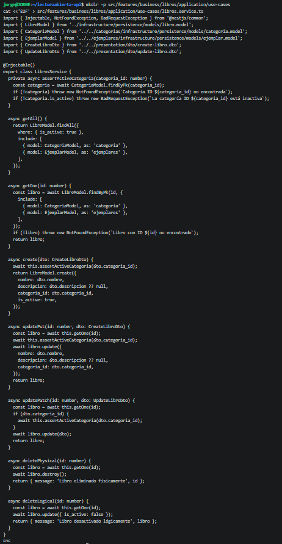

## Controlador y Módulo de Libros (LibrosModule - SIN AUTH)

mkdir -p src/features/business/libros/presentation/controllers
cat <<'EOF' > src/features/business/libros/presentation/controllers/libros.controller.ts
import { Controller, Get, Post, Put, Patch, Delete, Param, Body, ParseIntPipe } from '@nestjs/common';
import { ApiTags, ApiOperation } from '@nestjs/swagger';
import { LibrosService } from '../../application/use-cases/libros.service';
import { CreateLibroDto } from '../dto/create-libro.dto';
import { UpdateLibroDto } from '../dto/update-libro.dto';

@ApiTags('Libros')
@Controller('libros')
export class LibrosController {
  constructor(private readonly service: LibrosService) {}

  @Get()
  @ApiOperation({ summary: 'Listar libros activos con sus relaciones (SIN AUTH)' })
  getAll() {
    return this.service.getAll();
  }

  @Get(':id')
  @ApiOperation({ summary: 'Obtener libro por ID con categoría y ejemplares (SIN AUTH)' })
  getOne(@Param('id', ParseIntPipe) id: number) {
    return this.service.getOne(id);
  }

  @Post()
  @ApiOperation({ summary: 'Crear libro validando categoría activa (SIN AUTH)' })
  create(@Body() dto: CreateLibroDto) {
    return this.service.create(dto);
  }

  @Put(':id')
  @ApiOperation({ summary: 'Actualización total PUT de libro (SIN AUTH)' })
  updatePut(@Param('id', ParseIntPipe) id: number, @Body() dto: CreateLibroDto) {
    return this.service.updatePut(id, dto);
  }

  @Patch(':id')
  @ApiOperation({ summary: 'Actualización parcial PATCH de libro (SIN AUTH)' })
  updatePatch(@Param('id', ParseIntPipe) id: number, @Body() dto: UpdateLibroDto) {
    return this.service.updatePatch(id, dto);
  }

  @Delete(':id')
  @ApiOperation({ summary: 'Eliminación física de libro (SIN AUTH)' })
  deletePhysical(@Param('id', ParseIntPipe) id: number) {
    return this.service.deletePhysical(id);
  }

  @Patch(':id/deactivate')
  @ApiOperation({ summary: 'Eliminación lógica de libro (SIN AUTH)' })
  deleteLogical(@Param('id', ParseIntPipe) id: number) {
    return this.service.deleteLogical(id);
  }
}
EOF

cat <<'EOF' > src/features/business/libros/libros.module.ts
import { Module } from '@nestjs/common';
import { LibrosController } from './presentation/controllers/libros.controller';
import { LibrosService } from './application/use-cases/libros.service';

@Module({
  controllers: [LibrosController],
  providers: [LibrosService],
  exports: [LibrosService],
})
export class LibrosModule {}
EOF

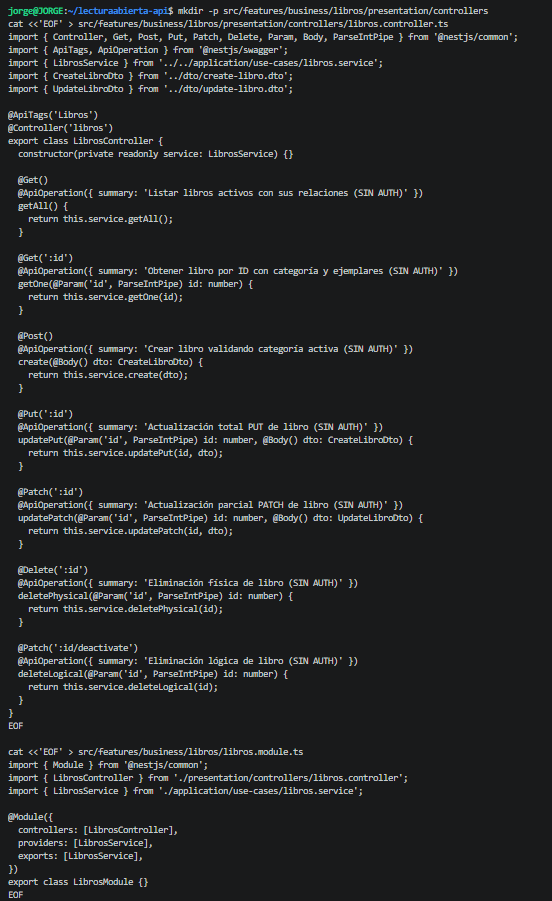

### Cierre del ISS

``
npm run dev

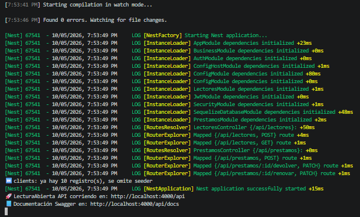

### ISS-08: Dejar Préstamos y Lectores 100% SIN AUTH

Para que todas las rutas sean SIN AUTH como exige el manual, actualizamos prestamos.controller.ts retirando la verificación manual de x-user-role:

**Objetivo:** ventas con ítems N:M vía feature propio `product-sale/` (tabla `product_sales`, API `/api/detalle-ventas`; detalle: `quantity`, `unit_price`, `line_total`); create transaccional de cabecera+ítems en `/api/ventas` con stock.  
**Bloqueado por:** ISS-07 (+ Client ISS-03).  
**API:** `/api/ventas` (cabecera) y `/api/detalle-ventas` (líneas) — **SIN AUTH**.

### Criterios de aceptación (ISS-08)

- [ ] Feature propio `src/features/business/product-sale/` (model, controller, routes, seeder, swagger, http, associations)
- [ ] Rutas `/api/detalle-ventas` montadas en aggregators
- [ ] **13.1** Modelos `sale` + feature `product-sale/` (tabla `product_sales`)
- [ ] **13.2** Controller Sale y ProductSale en orden getAll, getOne, create, update PUT/PATCH, delete físico y lógico (el create de Sale sigue siendo transaccional: cliente activo, stock, totales)
- [ ] **13.3** Routes `/api/ventas` + `/api/detalle-ventas` + http/ en ese mismo orden
- [ ] **13.4** Seeders: `sales` (cabeceras) → `product_sales` (líneas); clave `product_sales` en SeedCounts; swagger registry
- [ ] **13.5** **Relaciones** Client↔Sale (`sale.associations`) y Sale↔ProductSale↔Product (`product-sale.associations`)
- [ ] **13.6** Swagger Sale + ProductSale
- [ ] **13.7** Estado final consolidado (config / routes / seeders / swagger)

cat <<'EOF' > src/features/business/prestamos/presentation/controllers/prestamos.controller.ts
import { Controller, Post, Body, Param, Patch, ParseIntPipe } from '@nestjs/common';
import { ApiTags, ApiOperation } from '@nestjs/swagger';
import { PrestamosService } from '../../application/use-cases/prestamos.service';
import { CreatePrestamoDto } from '../dto/create-prestamo.dto';
import { ReturnPrestamoDto } from '../dto/return-prestamo.dto';
import { RenewPrestamoDto } from '../dto/renew-prestamo.dto';

@ApiTags('Prestamos')
@Controller('prestamos')
export class PrestamosController {
  constructor(private readonly prestamosService: PrestamosService) {}

  @Post()
  @ApiOperation({ summary: 'Registrar préstamo transaccional (SIN AUTH)' })
  async crearPrestamo(@Body() dto: CreatePrestamoDto) {
    return this.prestamosService.crearPrestamo(dto);
  }

  @Patch(':id/devolver')
  @ApiOperation({ summary: 'Liquidar devolución y calcular multas por mora/daño (SIN AUTH)' })
  async devolverPrestamo(
    @Param('id', ParseIntPipe) id: number,
    @Body() dto: ReturnPrestamoDto,
  ) {
    return this.prestamosService.devolverPrestamo(id, dto);
  }

  @Patch(':id/renovar')
  @ApiOperation({ summary: 'Renovar plazo de préstamo (SIN AUTH)' })
  async renovarPrestamo(
    @Param('id', ParseIntPipe) id: number,
    @Body() dto: RenewPrestamoDto,
  ) {
    return this.prestamosService.renovarPrestamo(id, dto);
  }
}
EOF

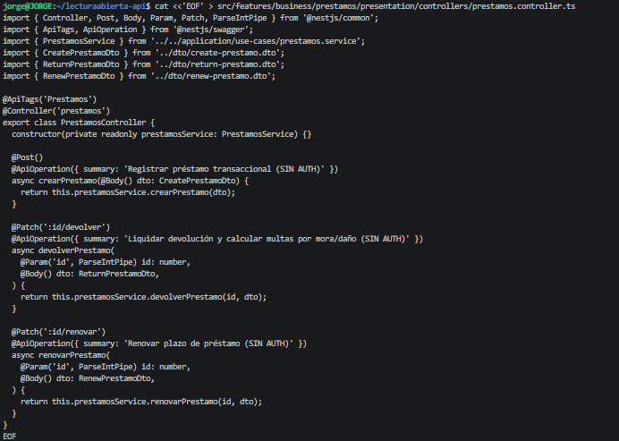

### Registrar Módulos en BusinessModule

cat <<'EOF' > src/features/business/business.module.ts
import { Module } from '@nestjs/common';
import { LectoresModule } from './lectores/lectores.module';
import { PrestamosModule } from './prestamos/prestamos.module';
import { CategoriasModule } from './categorias/categorias.module';
import { LibrosModule } from './libros/libros.module';

@Module({
  imports: [
    LectoresModule,
    PrestamosModule,
    CategoriasModule,
    LibrosModule,
  ],
  exports: [
    LectoresModule,
    PrestamosModule,
    CategoriasModule,
    LibrosModule,
  ],
})
export class BusinessModule {}
EOF

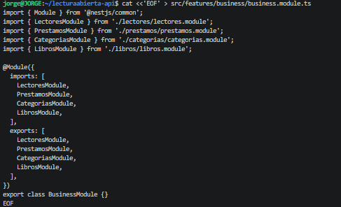

### ISS-04: Seeders con Faker y Runner (npm run db:seed)

El manual define un runner que inserta datos falsos con conteos configurables. Implementamos exactamente ese patrón para LecturaAbierta:

## 1. Conteos (src/database/seeders/counts.ts)

mkdir -p src/database/seeders
cat <<'EOF' > src/database/seeders/counts.ts
export type SeedCounts = {
  lectores: number;
  categorias: number;
  libros: number;
};

export const DEFAULT_SEED_COUNTS: SeedCounts = {
  lectores: 10,
  categorias: 5,
  libros: 15,
};

export function resolveSeedCounts(argv: string[] = process.argv.slice(2)): SeedCounts {
  const counts: SeedCounts = { ...DEFAULT_SEED_COUNTS };

  if (process.env.SEED_LECTORES) counts.lectores = Number(process.env.SEED_LECTORES);
  if (process.env.SEED_CATEGORIAS) counts.categorias = Number(process.env.SEED_CATEGORIAS);
  if (process.env.SEED_LIBROS) counts.libros = Number(process.env.SEED_LIBROS);

  for (const arg of argv) {
    const match = arg.match(/^--([a-zA-Z_]+)=(\d+)$/);
    if (!match) continue;
    const key = match[1] as keyof SeedCounts;
    const value = Number(match[2]);
    if (key in counts) counts[key] = value;
  }

  return counts;
}
EOF

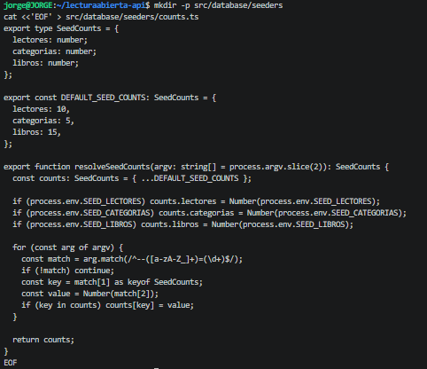

## 2. Runner Orquestador (src/database/seeders/index.ts)

cat <<'EOF' > src/database/seeders/index.ts
import { faker } from '@faker-js/faker';
import { Sequelize } from 'sequelize-typescript';
import { resolveSeedCounts } from './counts';
import { CategoriaModel } from '../../features/business/categorias/infrastructure/persistence/models/categoria.model';
import { LectorModel } from '../../features/business/lectores/infrastructure/persistence/models/lector.model';
import { LibroModel } from '../../features/business/libros/infrastructure/persistence/models/libro.model';
import { SedeModel } from '../../features/business/sedes/infrastructure/persistence/models/sede.model';
import { AutorModel } from '../../features/business/autores/infrastructure/persistence/models/autor.model';
import { LibroAutorModel } from '../../features/business/autores/infrastructure/persistence/models/libro-autor.model';
import { EjemplarModel } from '../../features/business/ejemplares/infrastructure/persistence/models/ejemplar.model';
import { PrestamoModel } from '../../features/business/prestamos/infrastructure/persistence/models/prestamo.model';
import { ReservaModel } from '../../features/business/reservas/infrastructure/persistence/models/reserva.model';
import { MultaModel } from '../../features/business/multas/infrastructure/persistence/models/multa.model';

async function runAllSeeders() {
  const counts = resolveSeedCounts();
  console.log('🌱 Iniciando SeedersRunner de LecturaAbierta...');
  console.log('📊 Conteos configurados:', counts);

  const sequelize = new Sequelize({
    dialect: 'sqlite',
    storage: 'lectura_abierta.db',
    logging: false,
    models: [
      LectorModel,
      CategoriaModel,
      AutorModel,
      SedeModel,
      LibroModel,
      LibroAutorModel,
      EjemplarModel,
      PrestamoModel,
      ReservaModel,
      MultaModel,
    ],
  });

  await sequelize.authenticate();
  await sequelize.sync({ force: false, alter: true });

  // 1. Seed Categorías
  const catCount = await CategoriaModel.count();
  if (catCount === 0) {
    const categorias = Array.from({ length: counts.categorias }, () => ({
      nombre: faker.commerce.department(),
      descripcion: faker.lorem.sentence(),
      is_active: true,
    }));
    await CategoriaModel.bulkCreate(categorias);
    console.log(`✅ Categorías: ${counts.categorias} sembradas`);
  }

  // 2. Seed Lectores
  const lectorCount = await LectorModel.count();
  if (lectorCount === 0) {
    const lectores = Array.from({ length: counts.lectores }, () => ({
      nombre: faker.person.fullName(),
      descripcion: faker.internet.email().toLowerCase(),
      is_active: true,
    }));
    await LectorModel.bulkCreate(lectores);
    console.log(`✅ Lectores: ${counts.lectores} sembrados`);
  }

  // 3. Seed Libros
  const libroCount = await LibroModel.count();
  if (libroCount === 0) {
    const cats = await CategoriaModel.findAll();
    if (cats.length > 0) {
      const libros = Array.from({ length: counts.libros }, () => ({
        nombre: faker.book.title(),
        descripcion: faker.lorem.paragraph(1),
        categoria_id: cats[Math.floor(Math.random() * cats.length)].id,
        is_active: true,
      }));
      await LibroModel.bulkCreate(libros);
      console.log(`✅ Libros: ${counts.libros} sembrados`);
    }
  }

  console.log('🌱 SeedersRunner finalizado con éxito.');
  await sequelize.close();
}

runAllSeeders().catch((err) => {
  console.error('❌ Error en SeedersRunner:', err);
  process.exit(1);
});
EOF

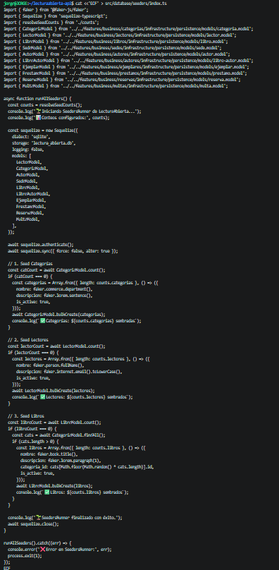

## 3. Registrar el Script db:seed en package.json

Asegura que package.json cuente con el script ejecutor:

node -e "
const fs = require('fs');
const pkg = JSON.parse(fs.readFileSync('package.json', 'utf8'));
pkg.scripts['db:seed'] = 'ts-node -r tsconfig-paths/register src/database/seeders/index.ts';
fs.writeFileSync('package.json', JSON.stringify(pkg, null, 2));
"
### Verificación Completa del DoD

Ejecuta las siguientes comprobaciones en tu terminal:

Ejecutar el Seeder Runner:
npm run db:seed
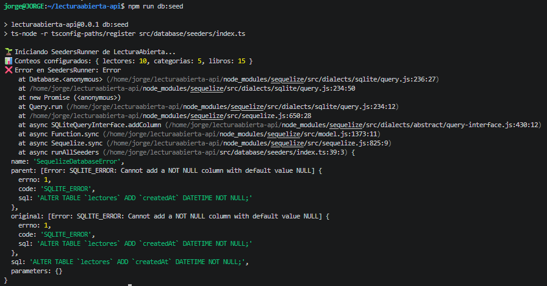

Compilar y validar tipado TypeScript:
npx tsc --noEmit

Iniciar la aplicación:
npm run start:dev

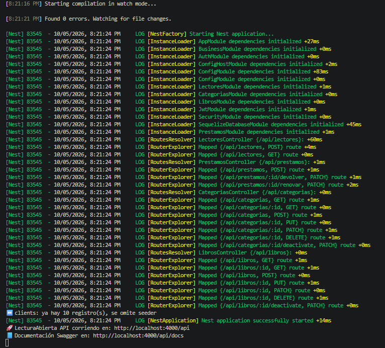

Abrir Swagger:

http://localhost:4000/api/docs

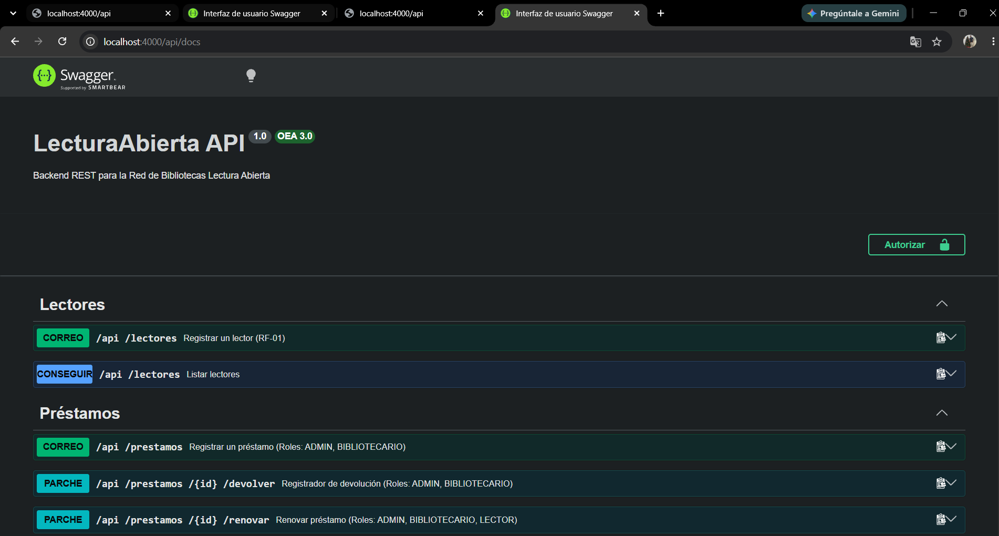